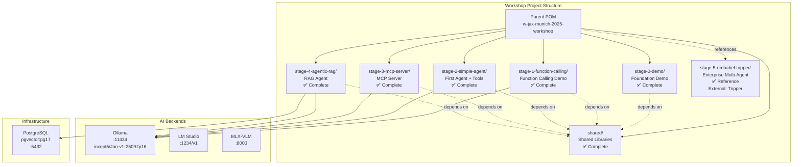
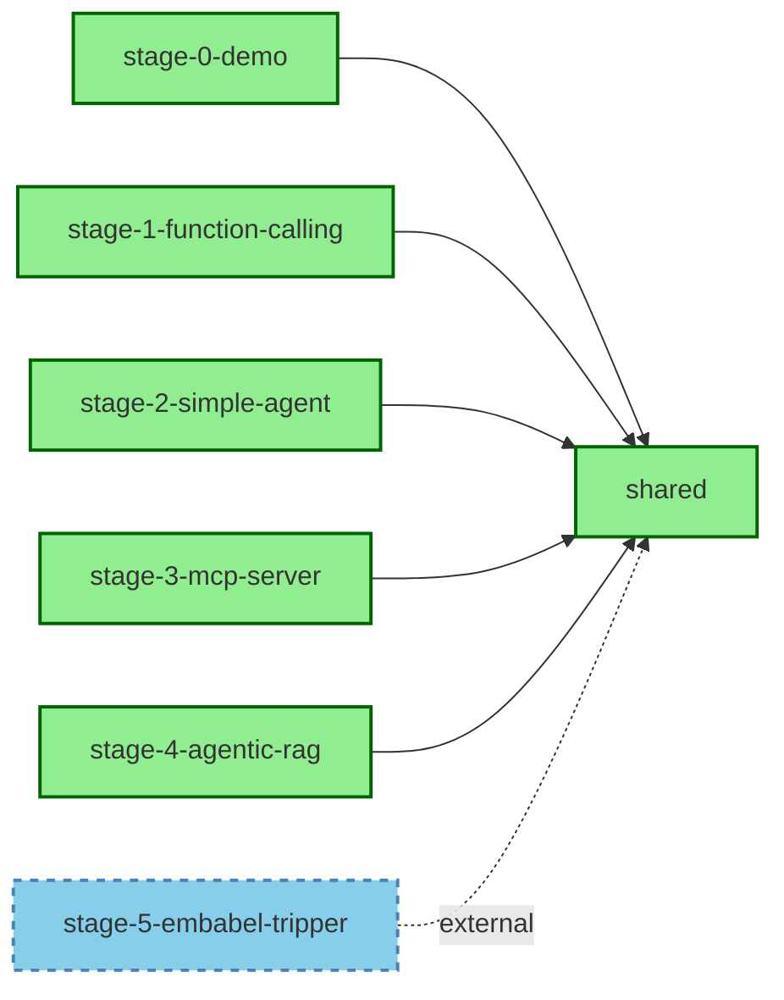

# W-JAX Munich 2025 Workshop - System Architecture

## Overview

This is a multi-module Maven workshop project demonstrating modern Java 21+ AI agent development patterns. The workshop progresses through 5 distinct stages (plus a foundation stage 0), each building upon shared foundational libraries.

**Workshop Duration**: 7 hours (09:00-16:30)  
**Format**: Hands-on coding with progressive complexity  
**Approach**: Build → Connect → Collaborate  
**Philosophy**: Privacy-first, open-source, no vendor lock-in

## Technologies

### Core Stack
- **Runtime**: Java 21+ (Virtual Threads, Records, Pattern Matching, Sealed Classes)
- **Build Tool**: Maven 3.9.0+
- **JSON Processing**: Gson 2.11.0
- **Logging**: SLF4J 2.0.16 + Logback 1.5.12
- **Testing**: JUnit 5.11.3

### AI Backends
- **Ollama**: Primary local LLM backend (default: localhost:11434, configurable)
- **LM Studio**: OpenAI-compatible local inference (default: localhost:1234/v1, configurable)
- **MLX-VLM**: Apple Silicon optimized vision models (default: localhost:8000, configurable)

**Configuration**: All backend URLs are externally configurable via environment variables or system properties. See [CONFIGURATION.md](./CONFIGURATION.md) for details.

### Default Model
- **Primary**: `incept5/Jan-v1-2509:fp16`
- **Alternatives**: Qwen 2.5 7B, Mistral 7B, Gemma 2 9B
- **Switchable**: Easy model configuration via CLI or config

### Key Technologies by Stage
- **Stage 0**: Backend abstraction, multi-modal support
- **Stage 1**: Function calling fundamentals with simple tools
- **Stage 2**: Agent loops with real external APIs
- **Stage 3**: MCP (Model Context Protocol) with official Java SDK
- **Stage 4**: RAG with PostgreSQL + pgvector
- **Stage 5**: Enterprise multi-agent system (Embabel Tripper - external reference)

## Workshop Agenda & Stage Mapping

### Full Day Schedule

| Time | Activity | Stage | Status |
|------|----------|-------|--------|
| 09:00-09:15 | Welcome & Overview | - | ✅ Presentation |
| 09:15-09:50 | Environment Setup & Verification | Stage 0 | ✅ Complete |
| 09:50-10:30 | How Agents Work (Teaching) | - | ✅ Presentation |
| 10:30-10:50 | Morning Break | - | - |
| 10:50-11:40 | Tool-Calling in Practice | Stage 1 | ✅ Complete |
| 11:40-12:30 | Exercise: First Working Agent | Stage 2 | ✅ Complete |
| 12:30-13:20 | Lunch Break | - | - |
| 13:20-13:40 | Recap & Transition to MCP | - | ✅ Presentation |
| 13:40-14:20 | MCP Deep Dive + Hands-On | Stage 3 | ✅ Complete |
| 14:20-14:55 | Agentic RAG & Data Integration | Stage 4 | ✅ Complete |
| 14:55-15:15 | Afternoon Break | - | - |
| 15:15-16:20 | Enterprise Multi-Agent (Tripper) | Stage 5 | ✅ Reference |
| 16:20-16:30 | Wrap-Up & Discussion | - | ✅ Presentation |

### Workshop Stages Summary

| Stage | Module | Duration | Focus | Status |
|-------|--------|----------|-------|--------|
| **0** | `stage-0-demo/` | Setup (35min) | Backend abstraction, multi-modal | ✅ Complete |
| **1** | `stage-1-function-calling/` | 40min | Function calling fundamentals | ✅ Complete |
| **2** | `stage-2-simple-agent/` | 50min | Tool calling, agent loops | ✅ Complete |
| **3** | `stage-3-mcp-server/` | 40min | MCP protocol, tool exposure | ✅ Complete |
| **4** | `stage-4-agentic-rag/` | 35min | RAG, vector search, embeddings | ✅ Complete |
| **5** | `stage-5-embabel-tripper/` | 65min | Enterprise multi-agent reference | ✅ Reference |

## System Architecture



## Module Structure

### Shared Module (`shared/`)

**Purpose**: Common libraries used across all workshop stages

**Key Components**:


**Exports**:
- `backend/` - Backend interface and implementations
- `model/` - AIResponse, ModelInfo, request/response records
- `exception/` - Sealed exception hierarchy
- `util/` - ImageEncoder, ParameterMapper, SSEStreamProcessor

**Architecture Link**: *[shared/architecture.md](./shared/architecture.md)* (to be created)

---

### Stage 0: Foundation Demo (`stage-0-demo/`) ✅

**Status**: Complete  
**Purpose**: Demonstrate backend abstraction and basic Ollama integration  
**Workshop Time**: 09:15-09:50 (35 min - Environment Setup)

**What Participants Learn**:
- Verify local Ollama installation
- Test model inference (streaming and non-streaming)
- Understand multi-backend architecture
- See image support across backends

**Key Components**:
- `OllamaDemo.java` - CLI application with full backend support
- `SimpleExample.java` - Minimal usage example
- Multiple backend implementations (Ollama, LM Studio, MLX-VLM)

**Running**:
```bash
cd stage-0-demo
./run.sh "Hello from the workshop!"
```

**Dependencies**: `shared`

---

### Stage 1: Function Calling Demo (`stage-1-function-calling/`) ✅

**Status**: Complete  
**Purpose**: Demonstrate LLM function calling capabilities with simple tools  
**Workshop Time**: 10:50-11:40 (50 min - Tool Calling Fundamentals)

**What Participants Learn**:
- Understand function calling protocol with Ollama
- Define function schemas using JSON Schema
- Test multiple models for function calling support
- See how LLMs extract parameters from prompts
- Analyze function calling results and statistics

**Learning Objectives**:
- Function calling mechanics before complex patterns
- Tool definition with JSON Schema
- Parameter extraction and validation
- Testing framework for function calling
- Understanding model capabilities

**Key Components**:
- `FunctionCallingDemo.java` - Main test runner with model filtering
- `FunctionCallingClient.java` - Ollama function calling client
- `tool/FunctionTool.java` - Tool interface
- `tool/DayOfWeekTool.java` - Parameter-free function demo
- `tool/WeatherTool.java` - Function with required parameters

**Sample Functions**:
1. **get_current_day()** - No parameters, returns current day of week
2. **get_weather(city)** - Required string parameter, returns mock weather

**Running**:
```bash
cd stage-1-function-calling
./run.sh                    # Test all models
./run.sh jan                # Test models with "jan"
./run.sh "qwen*" 20         # Test qwen models under 20GB
```

**Output**:
- Console: Real-time test progress
- CSV: `function_calling_results.csv` with statistics
- Summary: Success rates and timing information

**Test Cases**:
1. "What is the day of the week today?" → `get_current_day()`
2. "What is the weather in the capital of France?" → `get_weather(city=Paris)`
3. "Is it going to be sunny in Paris tomorrow?" → `get_weather(city=Paris)`

**Configuration**:
```java
private static final int NUM_RUNS = 10;
private static final double TEMPERATURE = 0.6;
private static final double DEFAULT_MAX_SIZE_GB = 100.0;
```

**Dependencies**: `shared`

**Architecture Link**: *[stage-1-function-calling/README.md](./stage-1-function-calling/README.md)*

---

### Stage 2: Simple Agent (`stage-2-simple-agent/`) ✅

**Status**: Complete  
**Purpose**: Build a working AI agent with tool-calling capabilities  
**Workshop Time**: 11:40-12:30 (50 min - First Working Agent)

**What Participants Build**:
- Complete agent loop (think → act → observe)
- Tool abstraction with real API integrations
- Multi-step reasoning with tool chaining
- Integration test with real Ollama backend

**Learning Objectives**:
- Understand agent reasoning loops
- Implement tool interface and registry
- Parse XML-style tool calls from LLM
- Handle real API calls (weather, country info)
- Write integration tests with real services

**Key Components**:
- `SimpleAgent.java` - ~200 lines, complete agent loop
- `tool/Tool.java` - Tool interface
- `tool/ToolRegistry.java` - Tool management
- `tool/WeatherTool.java` - Real wttr.in API integration
- `tool/CountryInfoTool.java` - Real REST Countries API
- `util/ToolCallParser.java` - Parse XML tool calls
- `SimpleAgentIntegrationTest.java` - Real API + Ollama tests

**Running**:
```bash
cd stage-2-simple-agent
./run.sh "What's the weather in the capital of Japan?"
./run.sh --verbose "Tell me about Brazil"
```

**Testing**:
```bash
mvn test  # Runs integration test with real Ollama
```

**Dependencies**: `shared`

**Architecture Link**: *[stage-2-simple-agent/README.md](./stage-2-simple-agent/README.md)*

---

### Stage 3: MCP Server & Agent (`stage-3-mcp-server/`) ✅

**Status**: Complete  
**Purpose**: Build Model Context Protocol server AND agent that uses MCP tools  
**Workshop Time**: 13:40-14:20 (40 min - MCP Deep Dive)

**What Participants Build**:
- MCP server that exposes tools via JSON-RPC 2.0
- MCP client that connects to server via STDIO
- AI agent that uses MCP tools for reasoning
- Three operating modes: server, agent, and interactive

**Learning Objectives**:
- Understand MCP protocol fundamentals
- Build both MCP server and client
- Expose and consume tools through MCP
- Create agent that leverages MCP architecture
- Manage subprocess communication

**Key Components**:
- `SimpleMCPServer.java` - MCP server with JSON-RPC 2.0
- `MCPClient.java` - MCP client with subprocess management
- `MCPAgent.java` - AI agent using MCP tools
- `MCPDemo.java` - Multi-mode demo (server/agent/interactive)
- `tool/Tool.java` - Tool interface with JSON Schema support
- `tool/WeatherTool.java` - Weather tool with MCP compatibility
- `tool/CountryInfoTool.java` - Country info tool with MCP compatibility

**Dependencies**: `shared`

**Protocol Implementation**:
- JSON-RPC 2.0 over STDIO
- MCP initialization handshake
- Tool discovery via `tools/list`
- Tool execution via `tools/call`
- JSON Schema parameter validation
- Subprocess management for server

**Running**:
```bash
cd stage-3-mcp-server

# Server mode (for MCP Inspector/Claude)
./run.sh server

# Agent mode (single task)
./run.sh agent "What's the weather in Tokyo?"

# Interactive mode (chat)
./run.sh interactive
```

**Testing with MCP Inspector**:
```bash
npx @modelcontextprotocol/inspector java -jar target/stage-3-mcp-server.jar server
```

**Architecture Link**: *[stage-3-mcp-server/README.md](./stage-3-mcp-server/README.md)*

---

### Stage 4: Agentic RAG (`stage-4-agentic-rag/`) ✅

**Status**: Complete  
**Purpose**: Add retrieval-augmented generation with PostgreSQL + pgvector  
**Workshop Time**: 14:20-14:55 (35 min - Agentic RAG)

**What Participants Build**:
- PostgreSQL database with pgvector extension
- Document chunking and embedding pipeline
- RAG agent that retrieves from vector store
- Integration test with real documents and embeddings
- Docker-based PostgreSQL setup

**Learning Objectives**:
- Use production-ready vector database (pgvector)
- Generate and store embeddings via Ollama
- Retrieve relevant context using similarity search
- Integrate RAG into agent reasoning loop
- Work with Docker for local infrastructure

**Key Components**:
- ✅ `PgVectorStore.java` - PostgreSQL + pgvector integration
- ✅ `DocumentChunker.java` - Chunking with overlap
- ✅ `EmbeddingService.java` - Ollama embedding generation
- ✅ `IngestionService.java` - Main ingestion orchestration
- ✅ `RAGAgent.java` - Agent with RAG capabilities
- ✅ `RAGTool.java` - RAG tool for document retrieval
- ✅ `ToolRegistry.java` - Tool management
- ✅ `ConversationMemory.java` - Multi-turn conversation support
- ✅ `RAGAgentDemo.java` - Interactive demo
- ✅ `docker-compose.yml` - PostgreSQL + pgvector setup
- ✅ `ingest.sh` - One-command setup script
- ✅ `repos.yaml` - Repository configuration
- ✅ Flyway migrations - Database schema
- ✅ `RAGAgentIntegrationTest.java` - End-to-end test

**Dependencies**: `shared`

**New Libraries**:
- **PostgreSQL JDBC**: `org.postgresql:postgresql` (latest)
- **pgvector Java**: `com.pgvector:pgvector` (for vector operations)
- **HikariCP**: `com.zaxxer:HikariCP` (connection pooling)
- Embedding model via Ollama (e.g., `nomic-embed-text`)

**Docker Setup**:
```yaml
services:
  db:
    image: pgvector/pgvector:pg17
    container_name: pgvector-db
    environment:
      POSTGRES_USER: postgres
      POSTGRES_PASSWORD: password
      POSTGRES_DB: workshop_rag
    ports:
      - "5432:5432"
    volumes:
      - pgdata:/var/lib/postgresql/data

volumes:
  pgdata:
```

**Key Features**:
- Production-ready vector storage
- Efficient similarity search (cosine, L2, inner product)
- ACID transactions for data integrity
- Scalable to millions of vectors
- Standard SQL interface

**Running**:
```bash
cd stage-4-agentic-rag

# Start PostgreSQL + pgvector
docker-compose up -d

# Ingest documents (one-time setup)
./ingest.sh

# Run RAG agent (interactive mode)
./run.sh

# Run RAG agent (single query)
./run.sh "What are the key features of Spring AI?"
```

**Testing**:
```bash
mvn test  # Runs integration test with real Ollama + PostgreSQL
```

**Architecture Link**: *[stage-4-agentic-rag/README.md](./stage-4-agentic-rag/README.md)*

---

### Stage 5: Enterprise Multi-Agent System (`external: tripper/`) ✅

**Status**: Reference Implementation (External Repository)  
**Purpose**: Demonstrate production-ready multi-agent architecture with enterprise patterns  
**Workshop Time**: 15:15-16:20 (65 min - Combined Multi-Agent + Enterprise)  
**Repository**: https://github.com/Incept5/tripper  
**Local Path**: `/Users/adam/dev/opensource/explore-embabel/tripper`

**What Participants Explore**:
- Production Spring Boot agent application built with Embabel framework
- Multiple LLMs in single application (GPT-4.1, GPT-4.1-mini)
- MCP integration at scale (6+ MCP servers: Brave, Wikipedia, Google Maps, Airbnb, Puppeteer, GitHub)
- Spring Security with OAuth2 authentication
- Docker Compose infrastructure (MCP Gateway, Zipkin tracing)
- Modern web UI with htmx and Server-Sent Events (SSE)
- Real-world travel planning domain model

**Learning Objectives**:
- Understand production agent architecture with Embabel framework
- Multi-LLM orchestration patterns (different models for different tasks)
- Enterprise security patterns (OAuth2, environment-based secrets)
- Infrastructure as code (Docker Compose, containerized services)
- Monitoring and observability (Zipkin distributed tracing, Spring Actuator)
- Real-world MCP integration at scale (gateway pattern, tool filtering)
- Action-based agent design vs. loop-based agents
- Domain model-centric agent architecture

**Key Technologies**:
- **Language**: Kotlin (readable for Java developers)
- **Framework**: Spring Boot 3.5.6
- **Agent Framework**: Embabel (production agent framework)
- **LLMs**: GPT-4.1 (planner), GPT-4.1-mini (researcher)
- **Security**: Spring Security with OAuth2 (Google)
- **Frontend**: htmx with SSE streaming
- **Infrastructure**: Docker Compose, MCP Gateway
- **Observability**: Zipkin, Spring Actuator, structured logging
- **MCP Servers**: Brave Search, Wikipedia, Google Maps, Airbnb, Puppeteer, GitHub

**Enterprise Patterns Demonstrated**:

1. **Multi-Agent Architecture**:
   - Planner agent (GPT-4.1 for high-quality planning)
   - Researcher agent (GPT-4.1-mini for cost-effective research)
   - Role-based personas with specific goals and backstories
   - Deterministic planning with action-based design
   - Blackboard pattern for shared state

2. **Production Framework (Embabel)**:
   - Action-based agent design (vs. loop-based)
   - Type-safe domain models (TravelBrief, Itinerary, etc.)
   - Operation context for state management
   - Tool call control and response formats
   - Structured workflow orchestration

3. **Spring Boot Integration**:
   - Dependency injection for agent components
   - Configuration management (`application.yml`)
   - Spring Security configuration
   - Actuator endpoints for health and metrics
   - Auto-configuration with Embabel starters

4. **Security Patterns**:
   - OAuth2 with Google authentication
   - Environment-based secrets management (`.env` file)
   - Toggleable security for development
   - Custom OAuth2 user service
   - Secure API key handling

5. **Infrastructure as Code**:
   - Docker Compose for service orchestration
   - MCP Gateway containerization
   - Zipkin tracing setup
   - Docker Model Runner integration
   - Multi-profile compose files

6. **Monitoring & Observability**:
   - Spring Actuator endpoints (`/actuator`)
   - Distributed tracing with Zipkin
   - Structured logging (Spring Boot)
   - SSE event streaming for real-time updates
   - Platform information endpoint

7. **MCP at Scale**:
   - MCP Gateway for managing multiple servers
   - Tool filtering for security
   - Docker-based tool isolation
   - Dynamic tool discovery
   - Server-Sent Events transport

**Key Files to Explore**:
- `TripperAgent.kt` - Main agent logic with action-based design
- `application.yml` - Configuration with model selection and personas
- `SecurityConfig.kt` - OAuth2 and security patterns
- `compose.yaml` - Infrastructure definition
- `TripperApplication.kt` - Spring Boot entry point

**API Keys Required**:
- **OpenAI** - For GPT-4.1 models (~$0.10 per travel plan)
- **Brave Search** - For web search (free tier: 2000 queries/month)
- **Google Maps** - For location services (free tier sufficient)

**Setup Instructions**: See `stage-5-embabel-tripper/README.md` for detailed setup

**Architecture Link**: *[stage-5-embabel-tripper/README.md](./stage-5-embabel-tripper/README.md)*

---

## Module Dependencies



**Dependency Rules**:
- All stages depend on `shared` module
- Stages are independent from each other
- No circular dependencies
- Each stage can be built/run independently
- Stage 3 includes both MCP server AND client integration

## Project Build Structure

### Parent POM (`/pom.xml`)

**Responsibilities**:
- Define Maven modules
- Centralize dependency versions
- Configure compiler settings (Java 21+)
- Define common plugins (compiler, shade, surefire)

### Per-Module POM

Each stage module has its own `pom.xml` with:
- Dependency on `shared` module
- Stage-specific dependencies
- Executable JAR configuration
- Main class specification

**Example**:
```xml
<dependencies>
    <!-- Shared module -->
    <dependency>
        <groupId>com.incept5</groupId>
        <artifactId>shared</artifactId>
        <version>${project.version}</version>
    </dependency>
    
    <!-- Stage-specific dependencies -->
    ...
</dependencies>
```

## Running the Workshop

### Build All Modules
```bash
mvn clean package
```

### Build Specific Stage
```bash
mvn -pl stage-1-simple-agent clean package
```

### Run Stage with Shell Script
```bash
cd stage-1-simple-agent
./run.sh --prompt "Calculate 5 * 8"
```

### Run Stage Directly
```bash
java -jar stage-1-simple-agent/target/stage-1-simple-agent.jar
```

## File Organization

```
w-jax-munich-2025-workshop/
├── pom.xml                          # Parent POM
├── README.md                        # Workshop overview (updated)
├── AGENDA.md                        # Full day schedule
├── SETUP.md                         # Environment setup guide
├── architecture.md                  # This file
│
├── shared/                          # ✅ COMPLETE
│   ├── pom.xml
│   ├── README.md
│   └── src/main/java/com/incept5/ollama/
│       ├── backend/                 # AIBackend interface + implementations
│       ├── client/                  # OllamaClient HTTP client
│       ├── config/                  # Configuration records
│       ├── model/                   # Request/Response records
│       ├── exception/               # Sealed exception hierarchy
│       └── util/                    # ImageEncoder, SSEStreamProcessor, etc.
│
├── stage-0-demo/                    # ✅ COMPLETE
│   ├── pom.xml
│   ├── run.sh
│   └── src/main/java/com/incept5/ollama/
│       ├── OllamaDemo.java          # Full-featured CLI demo
│       └── SimpleExample.java       # Minimal usage example
│
├── stage-1-function-calling/        # ✅ COMPLETE
│   ├── pom.xml
│   ├── README.md                    # Stage guide
│   ├── run.sh                       # Quick run script
│   └── src/main/java/com/incept5/workshop/stage1/
│       ├── FunctionCallingDemo.java # Main test runner
│       ├── FunctionCallingClient.java # Ollama function calling client
│       └── tool/
│           ├── FunctionTool.java    # Tool interface
│           ├── DayOfWeekTool.java   # Day of week function
│           └── WeatherTool.java     # Weather function
│
├── stage-2-simple-agent/            # ✅ COMPLETE
│   ├── pom.xml
│   ├── README.md                    # Comprehensive stage guide
│   ├── IMPLEMENTATION_NOTES.md      # Implementation details
│   ├── run.sh                       # Quick run script
│   └── src/
│       ├── main/java/com/incept5/workshop/stage1/
│       │   ├── SimpleAgent.java
│       │   ├── SimpleAgentDemo.java
│       │   ├── tool/
│       │   │   ├── Tool.java
│       │   │   ├── ToolRegistry.java
│       │   │   ├── WeatherTool.java
│       │   │   └── CountryInfoTool.java
│       │   └── util/
│       │       ├── ToolCallParser.java
│       │       └── HttpHelper.java
│       └── test/java/com/incept5/workshop/stage1/
│           ├── README.md            # Test documentation
│           └── SimpleAgentIntegrationTest.java
│
├── stage-3-mcp-server/              # ✅ COMPLETE
│   ├── pom.xml
│   ├── README.md
│   ├── run.sh
│   └── src/
│       └── main/java/com/incept5/workshop/stage2/
│           ├── SimpleMCPServer.java
│           ├── MCPDemo.java
│           └── tool/
│               ├── Tool.java
│               ├── WeatherTool.java
│               └── CountryInfoTool.java
│
├── stage-4-agentic-rag/             # ✅ COMPLETE
│   ├── pom.xml
│   ├── README.md
│   ├── run.sh
│   ├── ingest.sh
│   ├── repos.yaml
│   ├── docker-compose.yml           # PostgreSQL + pgvector setup
│   └── src/
│       ├── main/java/com/incept5/workshop/stage3/
│       │   ├── agent/
│       │   │   ├── RAGAgent.java
│       │   │   ├── RAGAgentDemo.java
│       │   │   └── ConversationMemory.java
│       │   ├── db/
│       │   │   ├── PgVectorStore.java
│       │   │   ├── DatabaseConfig.java
│       │   │   └── Document.java
│       │   ├── ingestion/
│       │   │   ├── IngestionService.java
│       │   │   ├── DocumentChunker.java
│       │   │   ├── EmbeddingService.java
│       │   │   ├── IngestionConfig.java
│       │   │   └── RepoConfig.java
│       │   ├── tool/
│       │   │   ├── Tool.java
│       │   │   ├── ToolRegistry.java
│       │   │   └── RAGTool.java
│       │   └── util/
│       │       └── JsonToolCallParser.java
│       └── test/java/com/incept5/workshop/stage3/
│           └── RAGAgentIntegrationTest.java
│
└── stage-5-embabel-tripper/         # ✅ REFERENCE (External)
    ├── README.md                    # Setup and exploration guide
    ├── API_KEYS.md                  # API key setup instructions
    └── EXPLORATION.md               # Guided code exploration activities
    
    # Note: Actual code lives in external repository:
    # https://github.com/Incept5/tripper
    # Local path: /Users/adam/dev/opensource/explore-embabel/tripper
```

## Design Principles

### Modern Java Features

All modules leverage Java 21+ features:
- **Records**: Immutable data transfer objects (configurations, requests, responses)
- **Virtual Threads**: Efficient I/O-bound operations (Project Loom)
- **Pattern Matching**: Enhanced switch expressions for cleaner code
- **Sealed Classes**: Type-safe exception hierarchies
- **Text Blocks**: Multi-line string literals for prompts/JSON
- **var**: Type inference for reduced verbosity

### Architecture Patterns

- **Strategy Pattern**: Backend abstraction (AIBackend interface)
- **Factory Pattern**: Backend creation (BackendFactory)
- **Builder Pattern**: Complex object construction (configs, requests)
- **Template Method**: AbstractHttpBackend reduces duplication
- **Observer Pattern**: Streaming responses with consumers
- **Dependency Injection**: Constructor-based DI throughout

### Best Practices

- **Immutability**: Records and unmodifiable collections
- **Resource Management**: try-with-resources for AutoCloseable
- **Type Safety**: Sealed exceptions for compile-time safety
- **Separation of Concerns**: Clean package boundaries
- **Single Responsibility**: Each class has one clear purpose
- **Interface Segregation**: Small, focused interfaces
- **Dependency Inversion**: Depend on abstractions (AIBackend)

## Testing Strategy

### Test Requirements (Per User Specifications)

Each stage must include:
1. ✅ **Single Happy Path Integration Test**
   - One comprehensive test covering the main workflow
   - Real API/service calls (not mocks)
   - Real Ollama backend with configured model
   - Clear, documented test scenarios

2. ✅ **Real Service Integration**
   - Tests use actual Ollama instance (localhost:11434)
   - Tests call real external APIs (weather, country info, etc.)
   - Tests verify end-to-end functionality
   - No mocking of external services

3. ✅ **Model Configuration**
   - Default model: `incept5/Jan-v1-2509:fp16`
   - Easily switchable via BackendConfig
   - Clear documentation on model requirements

### Test Organization

```
src/
├── main/java/com/incept5/workshop/stageN/
│   ├── StageNAgent.java
│   └── ...
└── test/java/com/incept5/workshop/stageN/
    ├── StageNIntegrationTest.java  ← Single comprehensive test
    └── README.md                     ← Test documentation
```

### Example (Stage 1)

See `stage-1-simple-agent/src/test/java/.../SimpleAgentIntegrationTest.java`:
- ✅ Tests complete agent loop with real Ollama
- ✅ Tests tool calling with real wttr.in and REST Countries APIs
- ✅ Tests multi-step reasoning (country lookup → weather lookup)
- ✅ Validates response quality and iteration counts
- ✅ Includes verbose output for debugging

### Running Tests

```bash
# Run all tests
mvn test

# Run specific stage test
mvn -pl stage-1-simple-agent test

# Skip tests (if Ollama not available)
mvn package -DskipTests
```

### Test Prerequisites

1. **Ollama Running**: `ollama serve`
2. **Model Available**: `ollama pull incept5/Jan-v1-2509:fp16`
3. **Network Access**: For external API calls
4. **Java 21+**: Required for virtual threads and modern features

## Documentation Structure

### Root Level
- `README.md` - Workshop overview, prerequisites, quick start
- `SETUP.md` - Environment setup (Java, Maven, Ollama, models)
- `architecture.md` - This file (overall system architecture)

### Per Module
- `README.md` - Learning objectives, exercises, running instructions
- `architecture.md` - Module-specific architecture details
- Code comments - JavaDoc for public APIs

### Cross-References
- Root architecture links to module architectures
- Module architectures link back to root
- Clear navigation between stages

## Current Implementation Status

### ✅ Completed Modules

1. **shared/** - Fully functional backend abstraction
   - Multi-backend support (Ollama, LM Studio, MLX-VLM)
   - Image encoding and multi-modal capabilities
   - Sealed exception hierarchy
   - Streaming and async support

2. **stage-0-demo/** - Working foundation
   - CLI application with all backend options
   - Raw output mode for scripting
   - Model parameter control
   - Image support across all backends

3. **stage-1-function-calling/** - Function calling demonstration
   - Test multiple models for function calling capability
   - Two sample functions (day of week, weather)
   - CSV results export with statistics
   - Model filtering by name and size
   - No external API calls (mock data)

4. **stage-2-simple-agent/** - Complete agent implementation
   - Full agent loop (think → act → observe)
   - Real API tools (weather, country info)
   - Multi-step reasoning
   - Integration test with real Ollama
   - Verbose mode for debugging
   - CLI model override support (--model flag)

5. **stage-3-mcp-server/** - MCP server implementation
   - JSON-RPC 2.0 protocol over STDIO
   - Tool discovery and execution
   - MCP initialization handshake
   - JSON Schema parameter validation
   - Compatible with MCP Inspector and Claude Desktop

6. **stage-4-agentic-rag/** - RAG agent implementation
   - PostgreSQL + pgvector integration
   - Document chunking and embedding pipeline
   - Similarity search with cosine distance
   - RAG tool for document retrieval
   - Multi-turn conversation support
   - Integration test with real documents and embeddings

### ✅ Reference Implementation
- **stage-5-embabel-tripper/** - Enterprise multi-agent system (external repository)
  - Production-ready Spring Boot + Embabel application
  - Multiple LLMs, MCP at scale, OAuth2 security
  - Docker Compose infrastructure, Zipkin tracing
  - Real-world travel planning domain

### Migration Notes

The existing code has been organized into:
- `shared/` - All reusable backend/client code
- `stage-0-demo/` - Foundation demonstration
- `stage-1-function-calling/` - Function calling fundamentals
- `stage-2-simple-agent/` - First real agent with tools
- `stage-3-mcp-server/` - MCP server and agent
- `stage-4-agentic-rag/` - RAG with pgvector
- `stage-5-embabel-tripper/` - Enterprise reference (external)

No further migration needed for completed modules.

## Future Workshop Enhancements

Potential additions for future workshops:
- **Advanced Stage**: Streaming UI with WebSocket
- **Advanced Stage**: Long-term memory (vector + graph DB)
- **Advanced Stage**: External API integrations (stocks, news, etc.)
- **Advanced Stage**: Agent evaluation and benchmarking
- **Advanced Stage**: Fine-tuning and prompt optimization

## Quick Start Guide

### Prerequisites

1. **Java 21+** installed
2. **Maven 3.9.0+** installed
3. **Docker** and **Docker Compose** (for Stage 3+)
4. **Ollama** running with models:
   ```bash
   ollama serve
   ollama pull incept5/Jan-v1-2509:fp16
   ollama pull nomic-embed-text  # For Stage 3 embeddings
   ```

### Build & Run

```bash
# Build everything from root (creates JARs in each module's target/)
mvn clean package
# Creates:
#   shared/target/shared-1.0-SNAPSHOT.jar (library)
#   stage-0-demo/target/stage-0-demo.jar (executable)
#   stage-1-simple-agent/target/stage-1-simple-agent.jar (executable)

# Run Stage 0 (Foundation)
cd stage-0-demo
./run.sh "Hello from W-JAX!"

# Run Stage 1 (Function Calling)
cd stage-1-function-calling
./run.sh

# Run Stage 2 (Simple Agent)
cd stage-2-simple-agent
./run.sh "What's the weather in Munich?"
./run.sh --model qwen2.5:7b "Tell me about Germany"
./run.sh --verbose "Tell me about Germany"
./run.sh -m mistral:7b -v "Compare Paris and London"

# Run Stage 3 (MCP Server)
cd stage-3-mcp-server
./run.sh agent "What's the weather in Tokyo?"

# Run Stage 4 (RAG - requires Docker)
cd stage-4-agentic-rag
docker-compose up -d  # Start PostgreSQL + pgvector
./run.sh "What does the documentation say about..."

# Run tests
mvn test

# Build specific module with dependencies
mvn -pl stage-2-simple-agent -am clean package
```

### Switching Models

**Stage 0 (Demo):**
```bash
cd stage-0-demo
./run.sh -m "qwen2.5:7b" "Hello from W-JAX"
```

**Stage 2 (Simple Agent):**
```bash
cd stage-2-simple-agent
./run.sh --model qwen2.5:7b "What's the weather in Tokyo?"
./run.sh -m mistral:7b -v "Tell me about Japan"
```

**Programmatically (all stages):**
Edit the default model in `BackendConfig.Builder`:
```java
// In shared/src/main/java/com/incept5/ollama/config/BackendConfig.java
private String model = "your-preferred-model";  // ← Change default here
```

## Resources

### Internal Documentation
- [Workshop Agenda](./AGENDA.md) - Full day schedule
- [Stage 2 README](./stage-2-simple-agent/README.md) - Complete with examples
- [Stage 2 Implementation Notes](./stage-2-simple-agent/IMPLEMENTATION_NOTES.md)
- Per-stage architecture docs (to be created for stages 3-5)

### External Resources
- [Java 21 Documentation](https://openjdk.org/projects/jdk/21/)
- [Maven Multi-Module Projects](https://maven.apache.org/guides/mini/guide-multiple-modules.html)
- [Ollama API Documentation](https://github.com/ollama/ollama/blob/main/docs/api.md)
- [Model Context Protocol Specification](https://modelcontextprotocol.io/)
- [Project Loom (Virtual Threads)](https://openjdk.org/projects/loom/)

---
