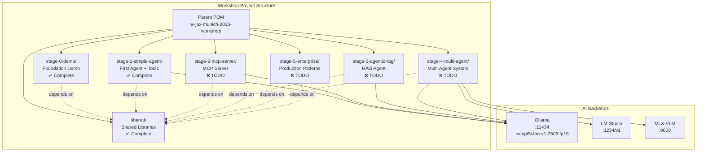
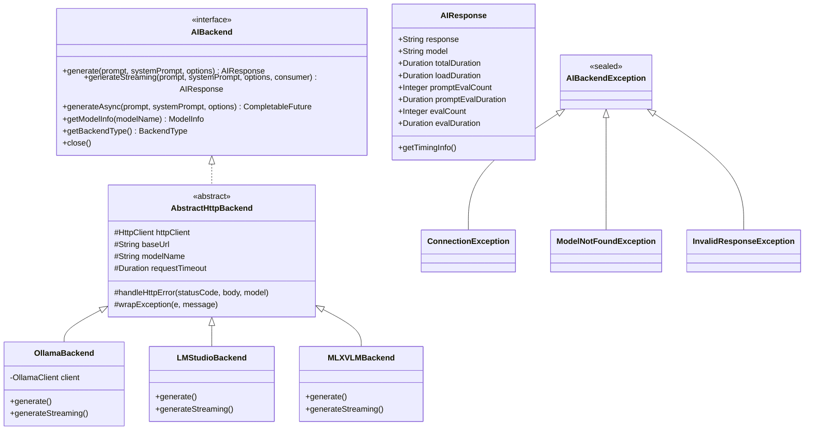
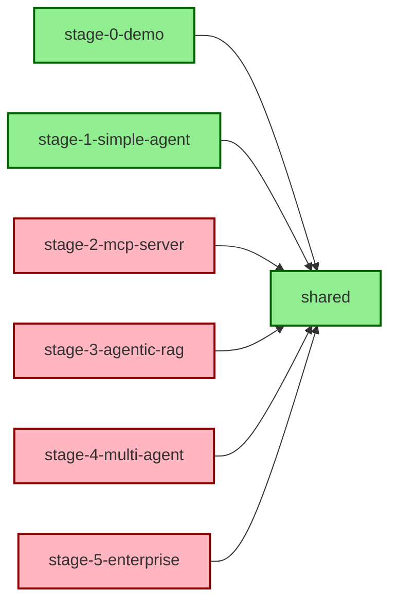

# W-JAX Munich 2025 Workshop - System Architecture

## Overview

This is a multi-module Maven workshop project demonstrating modern Java 21+ AI agent development patterns. The workshop progresses through 5 distinct stages (plus a foundation stage 0), each building upon shared foundational libraries.

**Workshop Duration**: 7 hours (09:00-16:30)  
**Format**: Hands-on coding with progressive complexity  
**Approach**: Build → Connect → Collaborate  
**Philosophy**: Privacy-first, open-source, no vendor lock-in

## Technologies

### Core Stack
- **Runtime**: Java 21+ (Virtual Threads, Records, Pattern Matching, Sealed Classes)
- **Build Tool**: Maven 3.9.0+
- **JSON Processing**: Gson 2.11.0
- **Logging**: SLF4J 2.0.16 + Logback 1.5.12
- **Testing**: JUnit 5.11.3

### AI Backends
- **Ollama**: Primary local LLM backend (default)
- **LM Studio**: OpenAI-compatible local inference
- **MLX-VLM**: Apple Silicon optimized vision models

### Default Model
- **Primary**: `incept5/Jan-v1-2509:fp16`
- **Alternatives**: Qwen 2.5 7B, Mistral 7B, Gemma 2 9B
- **Switchable**: Easy model configuration via CLI or config

### Key Technologies by Stage
- **Stage 0**: Backend abstraction, multi-modal support
- **Stage 1**: Tool calling, agent loops, real APIs
- **Stage 2**: MCP (Model Context Protocol) server/client
- **Stage 3**: RAG with in-memory vector store
- **Stage 4**: Multi-agent orchestration, heterogeneous models
- **Stage 5**: Production patterns, monitoring, security

## Workshop Agenda & Stage Mapping

### Full Day Schedule

| Time | Activity | Stage | Status |
|------|----------|-------|--------|
| 09:00-09:15 | Welcome & Overview | - | ✅ Presentation |
| 09:15-09:50 | Environment Setup & Verification | Stage 0 | ✅ Complete |
| 09:50-10:30 | How Agents Work (Teaching) | - | ✅ Presentation |
| 10:30-10:50 | Morning Break | - | - |
| 10:50-11:40 | Tool-Calling in Practice | Stage 1 | ✅ Complete |
| 11:40-12:30 | Exercise: First Working Agent | Stage 1 | ✅ Complete |
| 12:30-13:20 | Lunch Break | - | - |
| 13:20-13:40 | Recap & Transition to MCP | - | ✅ Presentation |
| 13:40-14:20 | MCP Deep Dive + Hands-On | Stage 2 | ❌ TODO |
| 14:20-14:55 | Agentic RAG & Data Integration | Stage 3 | ❌ TODO |
| 14:55-15:15 | Afternoon Break | - | - |
| 15:15-15:55 | Multi-Agent Teams | Stage 4 | ❌ TODO |
| 15:55-16:20 | Enterprise Patterns | Stage 5 | ❌ TODO |
| 16:20-16:30 | Wrap-Up & Discussion | - | ✅ Presentation |

### Workshop Stages Summary

| Stage | Module | Duration | Focus | Status |
|-------|--------|----------|-------|--------|
| **0** | `stage-0-demo/` | Setup (35min) | Backend abstraction, multi-modal | ✅ Complete |
| **1** | `stage-1-simple-agent/` | 3h 15min | Tool calling, agent loops | ✅ Complete |
| **2** | `stage-2-mcp-server/` | 40min | MCP protocol, tool exposure | ❌ TODO |
| **3** | `stage-3-agentic-rag/` | 35min | RAG, vector search, embeddings | ❌ TODO |
| **4** | `stage-4-multi-agent/` | 40min | Multi-agent, orchestration | ❌ TODO |
| **5** | `stage-5-enterprise/` | 25min | Production patterns | ❌ TODO |

## System Architecture



## Module Structure

### Shared Module (`shared/`)

**Purpose**: Common libraries used across all workshop stages

**Key Components**:


**Exports**:
- `backend/` - Backend interface and implementations
- `model/` - AIResponse, ModelInfo, request/response records
- `exception/` - Sealed exception hierarchy
- `util/` - ImageEncoder, ParameterMapper, SSEStreamProcessor

**Architecture Link**: *[shared/architecture.md](./shared/architecture.md)* (to be created)

---

### Stage 0: Foundation Demo (`stage-0-demo/`) ✅

**Status**: Complete  
**Purpose**: Demonstrate backend abstraction and basic Ollama integration  
**Workshop Time**: 09:15-09:50 (35 min - Environment Setup)

**What Participants Learn**:
- Verify local Ollama installation
- Test model inference (streaming and non-streaming)
- Understand multi-backend architecture
- See image support across backends

**Key Components**:
- `OllamaDemo.java` - CLI application with full backend support
- `SimpleExample.java` - Minimal usage example
- Multiple backend implementations (Ollama, LM Studio, MLX-VLM)

**Running**:
```bash
cd stage-0-demo
./run.sh "Hello from the workshop!"
```

**Dependencies**: `shared`

---

### Stage 1: Simple Agent (`stage-1-simple-agent/`) ✅

**Status**: Complete  
**Purpose**: Build a working AI agent with tool-calling capabilities  
**Workshop Time**: 10:50-12:30 (1h 50min - Tool Calling + First Agent)

**What Participants Build**:
- Complete agent loop (think → act → observe)
- Tool abstraction with real API integrations
- Multi-step reasoning with tool chaining
- Integration test with real Ollama backend

**Learning Objectives**:
- Understand agent reasoning loops
- Implement tool interface and registry
- Parse XML-style tool calls from LLM
- Handle real API calls (weather, country info)
- Write integration tests with real services

**Key Components**:
- `SimpleAgent.java` - ~200 lines, complete agent loop
- `tool/Tool.java` - Tool interface
- `tool/ToolRegistry.java` - Tool management
- `tool/WeatherTool.java` - Real wttr.in API integration
- `tool/CountryInfoTool.java` - Real REST Countries API
- `util/ToolCallParser.java` - Parse XML tool calls
- `SimpleAgentIntegrationTest.java` - Real API + Ollama tests

**Running**:
```bash
cd stage-1-simple-agent
./run.sh "What's the weather in the capital of Japan?"
./run.sh --verbose "Tell me about Brazil"
```

**Testing**:
```bash
mvn test  # Runs integration test with real Ollama
```

**Dependencies**: `shared`

**Architecture Link**: *[stage-1-simple-agent/README.md](./stage-1-simple-agent/README.md)*

---

### Stage 2: MCP Server (`stage-2-mcp-server/`) ❌ TODO

**Status**: Not yet implemented  
**Purpose**: Build Model Context Protocol server that exposes tools  
**Workshop Time**: 13:40-14:20 (40 min - MCP Deep Dive)

**What Participants Build**:
- MCP server that exposes tools via protocol
- MCP client for tool discovery
- Agent integration with MCP (combining Stage 1 + 2)
- Integration test with MCP communication

**Learning Objectives**:
- Understand MCP protocol fundamentals
- Implement JSON-RPC style tool exposure
- Build MCP client for tool discovery
- Connect agent to MCP server

**Planned Components**:
- `SimpleMCPServer.java` - MCP protocol server
- `MCPClient.java` - MCP protocol client
- `tool/MCPToolAdapter.java` - Adapt Tool interface to MCP
- `MCPAgent.java` - Agent using MCP client
- `MCPAgentIntegrationTest.java` - Test with real MCP flow

**Dependencies**: `shared`

**New Libraries**:
- JSON-RPC library or hand-rolled JSON protocol
- HTTP server (Java built-in HttpServer)

**Architecture Link**: *To be created*

---

### Stage 3: Agentic RAG (`stage-3-agentic-rag/`) ❌ TODO

**Status**: Not yet implemented  
**Purpose**: Add retrieval-augmented generation with vector search  
**Workshop Time**: 14:20-14:55 (35 min - Agentic RAG)

**What Participants Build**:
- In-memory vector store with cosine similarity
- Document chunking and embedding pipeline
- RAG agent that retrieves before generating
- Integration test with real documents and embeddings

**Learning Objectives**:
- Implement simple vector database
- Generate and store embeddings locally
- Retrieve relevant context from documents
- Integrate RAG into agent reasoning loop

**Planned Components**:
- `RAGAgent.java` - Agent with RAG capabilities
- `SimpleVectorStore.java` - In-memory vector DB with cosine similarity
- `DocumentProcessor.java` - Chunking and embedding
- `EmbeddingService.java` - Local embedding generation
- `RAGDemo.java` - Demo with sample document corpus
- `RAGIntegrationTest.java` - Test with real embeddings

**Dependencies**: `shared`

**New Libraries**:
- Local embedding model (e.g., all-MiniLM-L6-v2 via Ollama)
- Vector math utilities (or hand-rolled)

**Architecture Link**: *To be created*

---

### Stage 4: Multi-Agent Teams (`stage-4-multi-agent/`) ❌ TODO

**Status**: Not yet implemented  
**Purpose**: Orchestrate multiple specialized agents working together  
**Workshop Time**: 15:15-15:55 (40 min - Multi-Agent Teams)

**What Participants Build**:
- Multi-agent orchestration system
- Specialized agents with different models
- Agent communication and coordination
- Integration test with collaborative workflow

**Learning Objectives**:
- Design multi-agent communication patterns
- Implement agent orchestration/routing
- Use heterogeneous models (Ollama + LM Studio + MLX-VLM)
- Coordinate agent specialization

**Planned Components**:
- `MultiAgentSystem.java` - Orchestrator with routing
- `SpecializedAgent.java` - Base class for specialized agents
- `agents/ResearchAgent.java` - Ollama for research tasks
- `agents/SummaryAgent.java` - LM Studio for summaries
- `agents/VisionAgent.java` - MLX-VLM for image analysis
- `MultiAgentDemo.java` - Collaborative task demo
- `MultiAgentIntegrationTest.java` - Multi-agent workflow test

**Dependencies**: `shared`

**Architecture Link**: *To be created*

---

### Stage 5: Enterprise Patterns (`stage-5-enterprise/`) ❌ TODO

**Status**: Not yet implemented  
**Purpose**: Production-ready patterns for deploying AI agents  
**Workshop Time**: 15:55-16:20 (25 min - Enterprise Patterns)

**What Participants Learn**:
- Monitoring and observability patterns
- Rate limiting and circuit breakers
- Security and authentication approaches
- Deployment considerations (Docker, K8s)

**Learning Objectives**:
- Understand production readiness requirements
- Implement monitoring and metrics
- Add resilience patterns
- Consider security implications

**Planned Components**:
- `EnterpriseAgent.java` - Agent with production features
- `monitoring/MetricsExample.java` - Metrics collection patterns
- `resilience/CircuitBreakerExample.java` - Resilience patterns
- `security/SecurityExample.java` - Auth/validation patterns
- Documentation on deployment strategies
- Less code, more patterns and best practices

**Dependencies**: `shared`

**New Libraries** (optional/examples):
- Micrometer for metrics (optional)
- Resilience4j for circuit breakers (optional)
- JWT library for security (optional)

**Note**: This stage is more documentation and pattern-focused than code-heavy, given the 25-minute time constraint.

**Architecture Link**: *To be created*

---

## Module Dependencies



**Dependency Rules**:
- All stages depend on `shared` module
- Stages are independent from each other
- No circular dependencies
- Each stage can be built/run independently
- Stage 2 includes both MCP server AND client integration

## Project Build Structure

### Parent POM (`/pom.xml`)

**Responsibilities**:
- Define Maven modules
- Centralize dependency versions
- Configure compiler settings (Java 21+)
- Define common plugins (compiler, shade, surefire)

### Per-Module POM

Each stage module has its own `pom.xml` with:
- Dependency on `shared` module
- Stage-specific dependencies
- Executable JAR configuration
- Main class specification

**Example**:
```xml
<dependencies>
    <!-- Shared module -->
    <dependency>
        <groupId>com.incept5</groupId>
        <artifactId>shared</artifactId>
        <version>${project.version}</version>
    </dependency>
    
    <!-- Stage-specific dependencies -->
    ...
</dependencies>
```

## Running the Workshop

### Build All Modules
```bash
mvn clean package
```

### Build Specific Stage
```bash
mvn -pl stage-1-simple-agent clean package
```

### Run Stage with Shell Script
```bash
cd stage-1-simple-agent
./run.sh --prompt "Calculate 5 * 8"
```

### Run Stage Directly
```bash
java -jar stage-1-simple-agent/target/stage-1-simple-agent.jar
```

## File Organization

```
w-jax-munich-2025-workshop/
├── pom.xml                          # Parent POM
├── README.md                        # Workshop overview (updated)
├── AGENDA.md                        # Full day schedule
├── SETUP.md                         # Environment setup guide
├── architecture.md                  # This file
│
├── shared/                          # ✅ COMPLETE
│   ├── pom.xml
│   ├── README.md
│   └── src/main/java/com/incept5/ollama/
│       ├── backend/                 # AIBackend interface + implementations
│       ├── client/                  # OllamaClient HTTP client
│       ├── config/                  # Configuration records
│       ├── model/                   # Request/Response records
│       ├── exception/               # Sealed exception hierarchy
│       └── util/                    # ImageEncoder, SSEStreamProcessor, etc.
│
├── stage-0-demo/                    # ✅ COMPLETE
│   ├── pom.xml
│   ├── run.sh
│   └── src/main/java/com/incept5/ollama/
│       ├── OllamaDemo.java          # Full-featured CLI demo
│       └── SimpleExample.java       # Minimal usage example
│
├── stage-1-simple-agent/            # ✅ COMPLETE
│   ├── pom.xml
│   ├── README.md                    # Comprehensive stage guide
│   ├── IMPLEMENTATION_NOTES.md      # Implementation details
│   ├── run.sh                       # Quick run script
│   └── src/
│       ├── main/java/com/incept5/workshop/stage1/
│       │   ├── SimpleAgent.java
│       │   ├── SimpleAgentDemo.java
│       │   ├── tool/
│       │   │   ├── Tool.java
│       │   │   ├── ToolRegistry.java
│       │   │   ├── WeatherTool.java
│       │   │   └── CountryInfoTool.java
│       │   └── util/
│       │       ├── ToolCallParser.java
│       │       └── HttpHelper.java
│       └── test/java/com/incept5/workshop/stage1/
│           ├── README.md            # Test documentation
│           └── SimpleAgentIntegrationTest.java
│
├── stage-2-mcp-server/              # ❌ TODO
│   ├── pom.xml
│   ├── README.md
│   ├── run.sh
│   └── src/
│       ├── main/java/com/incept5/workshop/stage2/
│       │   ├── SimpleMCPServer.java
│       │   ├── MCPClient.java
│       │   ├── MCPAgent.java
│       │   ├── tool/
│       │   │   └── MCPToolAdapter.java
│       │   └── MCPDemo.java
│       └── test/java/com/incept5/workshop/stage2/
│           ├── README.md
│           └── MCPIntegrationTest.java
│
├── stage-3-agentic-rag/             # ❌ TODO
│   ├── pom.xml
│   ├── README.md
│   ├── run.sh
│   └── src/
│       ├── main/java/com/incept5/workshop/stage3/
│       │   ├── RAGAgent.java
│       │   ├── SimpleVectorStore.java
│       │   ├── DocumentProcessor.java
│       │   ├── EmbeddingService.java
│       │   └── RAGDemo.java
│       └── test/java/com/incept5/workshop/stage3/
│           ├── README.md
│           └── RAGIntegrationTest.java
│
├── stage-4-multi-agent/             # ❌ TODO
│   ├── pom.xml
│   ├── README.md
│   ├── run.sh
│   └── src/
│       ├── main/java/com/incept5/workshop/stage4/
│       │   ├── MultiAgentSystem.java
│       │   ├── SpecializedAgent.java
│       │   ├── agents/
│       │   │   ├── ResearchAgent.java
│       │   │   ├── SummaryAgent.java
│       │   │   └── VisionAgent.java
│       │   └── MultiAgentDemo.java
│       └── test/java/com/incept5/workshop/stage4/
│           ├── README.md
│           └── MultiAgentIntegrationTest.java
│
└── stage-5-enterprise/              # ❌ TODO
    ├── pom.xml
    ├── README.md                    # Pattern-focused documentation
    ├── run.sh
    └── src/
        ├── main/java/com/incept5/workshop/stage5/
        │   ├── EnterpriseAgent.java
        │   ├── monitoring/
        │   │   └── MetricsExample.java
        │   ├── resilience/
        │   │   └── CircuitBreakerExample.java
        │   ├── security/
        │   │   └── SecurityExample.java
        │   └── EnterpriseDemo.java
        └── test/java/com/incept5/workshop/stage5/
            ├── README.md
            └── EnterpriseIntegrationTest.java
```

## Design Principles

### Modern Java Features

All modules leverage Java 21+ features:
- **Records**: Immutable data transfer objects (configurations, requests, responses)
- **Virtual Threads**: Efficient I/O-bound operations (Project Loom)
- **Pattern Matching**: Enhanced switch expressions for cleaner code
- **Sealed Classes**: Type-safe exception hierarchies
- **Text Blocks**: Multi-line string literals for prompts/JSON
- **var**: Type inference for reduced verbosity

### Architecture Patterns

- **Strategy Pattern**: Backend abstraction (AIBackend interface)
- **Factory Pattern**: Backend creation (BackendFactory)
- **Builder Pattern**: Complex object construction (configs, requests)
- **Template Method**: AbstractHttpBackend reduces duplication
- **Observer Pattern**: Streaming responses with consumers
- **Dependency Injection**: Constructor-based DI throughout

### Best Practices

- **Immutability**: Records and unmodifiable collections
- **Resource Management**: try-with-resources for AutoCloseable
- **Type Safety**: Sealed exceptions for compile-time safety
- **Separation of Concerns**: Clean package boundaries
- **Single Responsibility**: Each class has one clear purpose
- **Interface Segregation**: Small, focused interfaces
- **Dependency Inversion**: Depend on abstractions (AIBackend)

## Testing Strategy

### Test Requirements (Per User Specifications)

Each stage must include:
1. ✅ **Single Happy Path Integration Test**
   - One comprehensive test covering the main workflow
   - Real API/service calls (not mocks)
   - Real Ollama backend with configured model
   - Clear, documented test scenarios

2. ✅ **Real Service Integration**
   - Tests use actual Ollama instance (localhost:11434)
   - Tests call real external APIs (weather, country info, etc.)
   - Tests verify end-to-end functionality
   - No mocking of external services

3. ✅ **Model Configuration**
   - Default model: `incept5/Jan-v1-2509:fp16`
   - Easily switchable via BackendConfig
   - Clear documentation on model requirements

### Test Organization

```
src/
├── main/java/com/incept5/workshop/stageN/
│   ├── StageNAgent.java
│   └── ...
└── test/java/com/incept5/workshop/stageN/
    ├── StageNIntegrationTest.java  ← Single comprehensive test
    └── README.md                     ← Test documentation
```

### Example (Stage 1)

See `stage-1-simple-agent/src/test/java/.../SimpleAgentIntegrationTest.java`:
- ✅ Tests complete agent loop with real Ollama
- ✅ Tests tool calling with real wttr.in and REST Countries APIs
- ✅ Tests multi-step reasoning (country lookup → weather lookup)
- ✅ Validates response quality and iteration counts
- ✅ Includes verbose output for debugging

### Running Tests

```bash
# Run all tests
mvn test

# Run specific stage test
mvn -pl stage-1-simple-agent test

# Skip tests (if Ollama not available)
mvn package -DskipTests
```

### Test Prerequisites

1. **Ollama Running**: `ollama serve`
2. **Model Available**: `ollama pull incept5/Jan-v1-2509:fp16`
3. **Network Access**: For external API calls
4. **Java 21+**: Required for virtual threads and modern features

## Documentation Structure

### Root Level
- `README.md` - Workshop overview, prerequisites, quick start
- `SETUP.md` - Environment setup (Java, Maven, Ollama, models)
- `architecture.md` - This file (overall system architecture)

### Per Module
- `README.md` - Learning objectives, exercises, running instructions
- `architecture.md` - Module-specific architecture details
- Code comments - JavaDoc for public APIs

### Cross-References
- Root architecture links to module architectures
- Module architectures link back to root
- Clear navigation between stages

## Current Implementation Status

### ✅ Completed Modules

1. **shared/** - Fully functional backend abstraction
   - Multi-backend support (Ollama, LM Studio, MLX-VLM)
   - Image encoding and multi-modal capabilities
   - Sealed exception hierarchy
   - Streaming and async support

2. **stage-0-demo/** - Working foundation
   - CLI application with all backend options
   - Raw output mode for scripting
   - Model parameter control
   - Image support across all backends

3. **stage-1-simple-agent/** - Complete agent implementation
   - Full agent loop (think → act → observe)
   - Real API tools (weather, country info)
   - Multi-step reasoning
   - Integration test with real Ollama
   - Verbose mode for debugging

### ❌ TODO: Remaining Stages

- **stage-2-mcp-server/** - MCP protocol implementation
- **stage-3-agentic-rag/** - RAG with vector search
- **stage-4-multi-agent/** - Multi-agent orchestration
- **stage-5-enterprise/** - Production patterns

### Migration Notes

The existing code has been organized into:
- `shared/` - All reusable backend/client code
- `stage-0-demo/` - Foundation demonstration
- `stage-1-simple-agent/` - First real agent with tools

No further migration needed for completed modules.

## Future Workshop Enhancements

Potential additions for future workshops:
- **Advanced Stage**: Streaming UI with WebSocket
- **Advanced Stage**: Long-term memory (vector + graph DB)
- **Advanced Stage**: External API integrations (stocks, news, etc.)
- **Advanced Stage**: Agent evaluation and benchmarking
- **Advanced Stage**: Fine-tuning and prompt optimization

## Quick Start Guide

### Prerequisites

1. **Java 21+** installed
2. **Maven 3.9.0+** installed
3. **Ollama** running with model:
   ```bash
   ollama serve
   ollama pull incept5/Jan-v1-2509:fp16
   ```

### Build & Run

```bash
# Build everything
mvn clean package

# Run Stage 0 (Foundation)
cd stage-0-demo
./run.sh "Hello from W-JAX!"

# Run Stage 1 (Simple Agent)
cd stage-1-simple-agent
./run.sh "What's the weather in Munich?"
./run.sh --verbose "Tell me about Germany"

# Run tests
mvn test
```

### Switching Models

Edit the default model in `SimpleAgentDemo.java`:
```java
BackendConfig config = BackendConfig.builder()
    .backendType(BackendType.OLLAMA)
    .baseUrl("http://localhost:11434")
    .model("incept5/Jan-v1-2509:fp16")  // ← Change here
    .requestTimeout(Duration.ofSeconds(300))
    .build();
```

Or use CLI (Stage 0):
```bash
java -jar target/stage-0-demo.jar -m "qwen2.5:7b" -p "Hello"
```

## Resources

### Internal Documentation
- [Workshop Agenda](./AGENDA.md) - Full day schedule
- [Stage 1 README](./stage-1-simple-agent/README.md) - Complete with examples
- [Stage 1 Implementation Notes](./stage-1-simple-agent/IMPLEMENTATION_NOTES.md)
- Per-stage architecture docs (to be created for stages 2-5)

### External Resources
- [Java 21 Documentation](https://openjdk.org/projects/jdk/21/)
- [Maven Multi-Module Projects](https://maven.apache.org/guides/mini/guide-multiple-modules.html)
- [Ollama API Documentation](https://github.com/ollama/ollama/blob/main/docs/api.md)
- [Model Context Protocol Specification](https://modelcontextprotocol.io/)
- [Project Loom (Virtual Threads)](https://openjdk.org/projects/loom/)

---

*Last updated: 2025-01-06*  
*Architecture Version: 2.0*  
*Status: 3/6 stages complete (Stages 0, 1 complete; Stages 2-5 TODO)*
