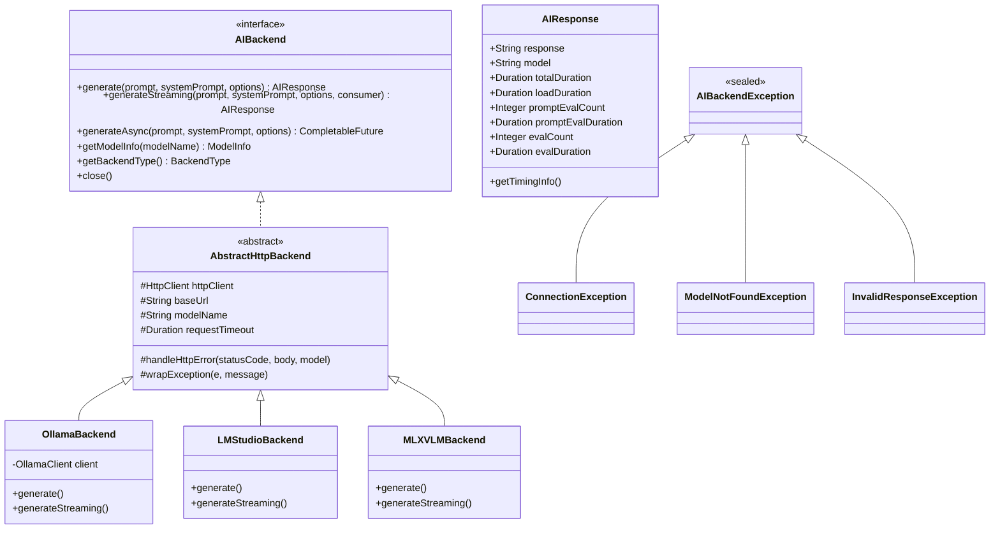

# W-JAX Munich 2025 Workshop - System Architecture

## Overview

This is a multi-module Maven workshop project demonstrating modern Java 21+ AI agent development patterns. The workshop progresses through 6 distinct stages, each building upon shared foundational libraries.

## Technologies

### Core Stack
- **Runtime**: Java 21+ (Virtual Threads, Records, Pattern Matching, Sealed Classes)
- **Build Tool**: Maven 3.9.0+
- **JSON Processing**: Gson 2.11.0
- **Logging**: SLF4J 2.0.16 + Logback 1.5.12
- **Testing**: JUnit 5.11.3

### AI Backends
- **Ollama**: Primary local LLM backend (default)
- **LM Studio**: OpenAI-compatible local inference
- **MLX-VLM**: Apple Silicon optimized vision models

### Planned Additions (by Stage)
- **Stage 2**: MCP (Model Context Protocol) server implementation
- **Stage 4**: Vector database integration (in-memory/embedded)
- **Stage 6**: Monitoring (Prometheus), Tracing, Security patterns

## Workshop Stages

The workshop is organized into 6 progressive stages over 7 hours:

| Stage | Time | Topic | Module |
|-------|------|-------|--------|
| 0 | Foundation | Shared Libraries | `shared/` |
| 1 | 09:15-12:30 | First Agent & Tool Calling | `stage-1-simple-agent/` |
| 2 | 13:40-14:20 | MCP Server Implementation | `stage-2-mcp-server/` |
| 3 | 14:20-15:00 | Agent with MCP Integration | `stage-3-agent-with-mcp/` |
| 4 | 14:20-15:00 | Agentic RAG & Data Integration | `stage-4-agentic-rag/` |
| 5 | 15:30-15:55 | Multi-Agent Teams | `stage-5-multi-agent/` |
| 6 | 15:55-16:20 | Enterprise Patterns | `stage-6-enterprise/` |

## System Architecture


## Module Structure

### Shared Module (`shared/`)

**Purpose**: Common libraries used across all workshop stages

**Key Components**:


**Exports**:
- `backend/` - Backend interface and implementations
- `model/` - AIResponse, ModelInfo, request/response records
- `exception/` - Sealed exception hierarchy
- `util/` - ImageEncoder, ParameterMapper, SSEStreamProcessor

**Architecture Link**: *[shared/architecture.md](./shared/architecture.md)* (to be created)

---

### Stage 1: Simple Agent (`stage-1-simple-agent/`)

**Purpose**: Introduction to AI agents with simple tool-calling capabilities

**Learning Objectives**:
- Understand agent architecture (loop: think → act → observe)
- Implement basic tool interface
- Parse and execute tool calls from LLM responses
- Handle tool results and continue conversation

**Key Components**:
- `SimpleAgent.java` - Basic agent loop implementation
- `tools/CalculatorTool.java` - Arithmetic operations
- `tools/WeatherTool.java` - Mock external API calls
- `SimpleAgentDemo.java` - CLI runner with examples

**Dependencies**: `shared`

**Architecture Link**: *[stage-1-simple-agent/architecture.md](./stage-1-simple-agent/architecture.md)* (to be created)

---

### Stage 2: MCP Server (`stage-2-mcp-server/`)

**Purpose**: Build a Model Context Protocol server that exposes tools

**Learning Objectives**:
- Understand MCP protocol basics
- Implement MCP server with tool registration
- Handle JSON-RPC requests/responses
- Expose file system and database tools

**Key Components**:
- `SimpleMCPServer.java` - MCP protocol implementation
- `tools/FileSystemTool.java` - Read/write file operations
- `tools/DatabaseTool.java` - Simple DB queries (in-memory)
- `MCPServerDemo.java` - Standalone server runner

**Dependencies**: `shared`

**New Libraries**:
- JSON-RPC library (TBD)
- SQLite or H2 for database examples

**Architecture Link**: *[stage-2-mcp-server/architecture.md](./stage-2-mcp-server/architecture.md)* (to be created)

---

### Stage 3: Agent with MCP (`stage-3-agent-with-mcp/`)

**Purpose**: Integrate Stage 1 agent with Stage 2 MCP server

**Learning Objectives**:
- Connect agent to external MCP server
- Discover available tools dynamically
- Route tool calls through MCP protocol
- Handle async tool execution

**Key Components**:
- `MCPAgent.java` - Agent with MCP client integration
- `MCPClient.java` - MCP protocol client
- `MCPAgentDemo.java` - Demo connecting to Stage 2 server

**Dependencies**: `shared`, communicates with `stage-2-mcp-server`

**Architecture Link**: *[stage-3-agent-with-mcp/architecture.md](./stage-3-agent-with-mcp/architecture.md)* (to be created)

---

### Stage 4: Agentic RAG (`stage-4-agentic-rag/`)

**Purpose**: Add retrieval-augmented generation with vector search

**Learning Objectives**:
- Implement simple vector database
- Generate embeddings for documents
- Retrieve relevant context before generation
- Combine retrieval with agent reasoning

**Key Components**:
- `RAGAgent.java` - Agent with RAG capabilities
- `VectorStore.java` - In-memory vector database
- `DocumentProcessor.java` - Chunking and embedding
- `RAGDemo.java` - Demo with document corpus

**Dependencies**: `shared`

**New Libraries**:
- Embedding model (local or API)
- Vector similarity library

**Architecture Link**: *[stage-4-agentic-rag/architecture.md](./stage-4-agentic-rag/architecture.md)* (to be created)

---

### Stage 5: Multi-Agent Teams (`stage-5-multi-agent/`)

**Purpose**: Orchestrate multiple specialized agents working together

**Learning Objectives**:
- Design multi-agent communication patterns
- Implement agent orchestration/routing
- Use heterogeneous models (Ollama + LM Studio + MLX-VLM)
- Handle agent specialization and delegation

**Key Components**:
- `MultiAgentSystem.java` - Orchestrator
- `agents/ResearchAgent.java` - Uses Ollama for research
- `agents/SummaryAgent.java` - Uses LM Studio for summaries
- `agents/CriticAgent.java` - Uses MLX-VLM for image analysis
- `MultiAgentDemo.java` - Collaborative task demo

**Dependencies**: `shared`

**Architecture Link**: *[stage-5-multi-agent/architecture.md](./stage-5-multi-agent/architecture.md)* (to be created)

---

### Stage 6: Enterprise Patterns (`stage-6-enterprise/`)

**Purpose**: Production-ready patterns for deploying AI agents

**Learning Objectives**:
- Add monitoring and observability
- Implement rate limiting and circuit breakers
- Handle security and authentication
- Containerization and deployment strategies

**Key Components**:
- `ProductionAgent.java` - Hardened agent implementation
- `monitoring/MetricsCollector.java` - Prometheus metrics
- `security/AuthenticationFilter.java` - JWT/API key auth
- `deployment/` - Docker, K8s examples

**Dependencies**: `shared`

**New Libraries**:
- Micrometer for metrics
- Resilience4j for circuit breakers
- JWT library for security

**Architecture Link**: *[stage-6-enterprise/architecture.md](./stage-6-enterprise/architecture.md)* (to be created)

---

## Module Dependencies


**Dependency Rules**:
- All stages depend on `shared` module
- Stages are independent from each other (except S2→S3)
- No circular dependencies
- Each stage can be built/run independently

## Project Build Structure

### Parent POM (`/pom.xml`)

**Responsibilities**:
- Define Maven modules
- Centralize dependency versions
- Configure compiler settings (Java 21+)
- Define common plugins (compiler, shade, surefire)

### Per-Module POM

Each stage module has its own `pom.xml` with:
- Dependency on `shared` module
- Stage-specific dependencies
- Executable JAR configuration
- Main class specification

**Example**:
```xml
<dependencies>
    <!-- Shared module -->
    <dependency>
        <groupId>com.incept5</groupId>
        <artifactId>shared</artifactId>
        <version>${project.version}</version>
    </dependency>
    
    <!-- Stage-specific dependencies -->
    ...
</dependencies>
```

## Running the Workshop

### Build All Modules
```bash
mvn clean package
```

### Build Specific Stage
```bash
mvn -pl stage-1-simple-agent clean package
```

### Run Stage with Shell Script
```bash
cd stage-1-simple-agent
./run.sh --prompt "Calculate 5 * 8"
```

### Run Stage Directly
```bash
java -jar stage-1-simple-agent/target/stage-1-simple-agent.jar
```

## File Organization

```
w-jax-munich-2025-workshop/
├── pom.xml                          # Parent POM
├── README.md                        # Workshop overview
├── SETUP.md                         # Environment setup guide
├── architecture.md                  # This file
├── run-stage.sh                     # Convenience script to run any stage
│
├── shared/
│   ├── pom.xml
│   ├── README.md
│   ├── architecture.md              # Shared module architecture
│   └── src/main/java/com/incept5/workshop/shared/
│       ├── backend/
│       ├── model/
│       ├── exception/
│       ├── config/
│       ├── client/
│       └── util/
│
├── stage-1-simple-agent/
│   ├── pom.xml
│   ├── README.md                    # Stage learning objectives
│   ├── architecture.md              # Stage architecture details
│   ├── run.sh                       # Quick run script
│   └── src/main/java/com/incept5/workshop/stage1/
│       ├── SimpleAgent.java
│       ├── tools/
│       └── SimpleAgentDemo.java
│
├── stage-2-mcp-server/
│   ├── pom.xml
│   ├── README.md
│   ├── architecture.md
│   ├── run-server.sh
│   └── src/main/java/com/incept5/workshop/stage2/
│       ├── SimpleMCPServer.java
│       ├── tools/
│       └── MCPServerDemo.java
│
├── stage-3-agent-with-mcp/
│   ├── pom.xml
│   ├── README.md
│   ├── architecture.md
│   ├── run.sh
│   └── src/main/java/com/incept5/workshop/stage3/
│       ├── MCPAgent.java
│       ├── MCPClient.java
│       └── MCPAgentDemo.java
│
├── stage-4-agentic-rag/
│   ├── pom.xml
│   ├── README.md
│   ├── architecture.md
│   ├── run.sh
│   └── src/main/java/com/incept5/workshop/stage4/
│       ├── RAGAgent.java
│       ├── VectorStore.java
│       ├── DocumentProcessor.java
│       └── RAGDemo.java
│
├── stage-5-multi-agent/
│   ├── pom.xml
│   ├── README.md
│   ├── architecture.md
│   ├── run.sh
│   └── src/main/java/com/incept5/workshop/stage5/
│       ├── MultiAgentSystem.java
│       ├── agents/
│       │   ├── ResearchAgent.java
│       │   ├── SummaryAgent.java
│       │   └── CriticAgent.java
│       └── MultiAgentDemo.java
│
└── stage-6-enterprise/
    ├── pom.xml
    ├── README.md
    ├── architecture.md
    ├── run.sh
    └── src/main/java/com/incept5/workshop/stage6/
        ├── ProductionAgent.java
        ├── monitoring/
        ├── security/
        └── deployment/
```

## Design Principles

### Modern Java Features

All modules leverage Java 21+ features:
- **Records**: Immutable data transfer objects (configurations, requests, responses)
- **Virtual Threads**: Efficient I/O-bound operations (Project Loom)
- **Pattern Matching**: Enhanced switch expressions for cleaner code
- **Sealed Classes**: Type-safe exception hierarchies
- **Text Blocks**: Multi-line string literals for prompts/JSON
- **var**: Type inference for reduced verbosity

### Architecture Patterns

- **Strategy Pattern**: Backend abstraction (AIBackend interface)
- **Factory Pattern**: Backend creation (BackendFactory)
- **Builder Pattern**: Complex object construction (configs, requests)
- **Template Method**: AbstractHttpBackend reduces duplication
- **Observer Pattern**: Streaming responses with consumers
- **Dependency Injection**: Constructor-based DI throughout

### Best Practices

- **Immutability**: Records and unmodifiable collections
- **Resource Management**: try-with-resources for AutoCloseable
- **Type Safety**: Sealed exceptions for compile-time safety
- **Separation of Concerns**: Clean package boundaries
- **Single Responsibility**: Each class has one clear purpose
- **Interface Segregation**: Small, focused interfaces
- **Dependency Inversion**: Depend on abstractions (AIBackend)

## Testing Strategy

Each module includes:
- **Unit Tests**: Test individual components in isolation
- **Integration Tests**: Test backend connectivity and MCP protocol
- **Example Tests**: Executable documentation of features

Test organization mirrors source structure:
```
src/
├── main/java/com/incept5/workshop/stageN/
└── test/java/com/incept5/workshop/stageN/
```

## Documentation Structure

### Root Level
- `README.md` - Workshop overview, prerequisites, quick start
- `SETUP.md` - Environment setup (Java, Maven, Ollama, models)
- `architecture.md` - This file (overall system architecture)

### Per Module
- `README.md` - Learning objectives, exercises, running instructions
- `architecture.md` - Module-specific architecture details
- Code comments - JavaDoc for public APIs

### Cross-References
- Root architecture links to module architectures
- Module architectures link back to root
- Clear navigation between stages

## Migration from Current Code

The existing monolithic structure will be refactored:

**Current** → **New Location**:
- `com.incept5.ollama.backend.*` → `shared/backend/`
- `com.incept5.ollama.client.*` → `shared/client/`
- `com.incept5.ollama.config.*` → `shared/config/`
- `com.incept5.ollama.model.*` → `shared/model/`
- `com.incept5.ollama.exception.*` → `shared/exception/`
- `com.incept5.ollama.util.*` → `shared/util/`
- `com.incept5.ollama.OllamaDemo` → Basis for `stage-1-simple-agent`
- `com.incept5.ollama.SimpleExample` → Stage 1 starting point

## Future Enhancements

Potential additions for future workshops:
- **Stage 7**: Streaming agent with WebSocket UI
- **Stage 8**: Agent with long-term memory (vector + graph DB)
- **Stage 9**: Function calling with external APIs (weather, stocks)
- **Stage 10**: Agent evaluation and benchmarking framework

## Resources

### Internal Documentation
- [Shared Module Architecture](./shared/architecture.md)
- [Stage 1 Architecture](./stage-1-simple-agent/architecture.md)
- [Stage 2 Architecture](./stage-2-mcp-server/architecture.md)
- [Stage 3 Architecture](./stage-3-agent-with-mcp/architecture.md)
- [Stage 4 Architecture](./stage-4-agentic-rag/architecture.md)
- [Stage 5 Architecture](./stage-5-multi-agent/architecture.md)
- [Stage 6 Architecture](./stage-6-enterprise/architecture.md)

### External Resources
- [Java 21 Documentation](https://openjdk.org/projects/jdk/21/)
- [Maven Multi-Module Projects](https://maven.apache.org/guides/mini/guide-multiple-modules.html)
- [Ollama API Documentation](https://github.com/ollama/ollama/blob/main/docs/api.md)
- [Model Context Protocol Specification](https://modelcontextprotocol.io/)
- [Project Loom (Virtual Threads)](https://openjdk.org/projects/loom/)

---

*Last updated: 2025-01-06*
*Architecture Version: 1.0*
