# Stage 4: Agentic RAG - Presentation Slides

## Slide 1: Two-Phase Architecture Overview

### **Phase 1: Ingestion Pipeline** (One-time setup)
```
Documents → Chunk → Embed → PostgreSQL+pgvector
   ↓         ↓       ↓         ↓
 .txt     800 tok  768 dim   487 chunks
```

**Key Components:**
- **Python Embedding Service** - Workaround for Ollama bug, generates 768-dim vectors
- **DocumentChunker** - Splits text with overlap (800 tokens/chunk, 200 overlap)
- **PgVectorStore** - PostgreSQL with pgvector for ACID + vector search
- **5 Repositories** - Embabel framework docs (pre-committed, no downloads)

**Running:** `./ingest.sh` (handles everything automatically)

---

### **Phase 2: RAG Agent** (Interactive chat)
```
Question → Embed → Search → LLM+Context → Answer
    ↓       ↓        ↓         ↓
  User   768 dim   Top 5    Grounded response
```

**Key Components:**
- **RAGAgent** - Conversational agent with memory (think → act → observe loop)
- **RAGTool** - Vector similarity search (cosine distance, 0.7 threshold)
- **ConversationMemory** - Multi-turn context retention
- **JSON Tool Calling** - Native Ollama format (cleaner than XML)

**Running:** `./run.sh` or `./run.sh --verbose`

---

### **Why RAG?**
- ✅ **Grounded answers** - Based on actual docs, not hallucinations
- ✅ **Semantic search** - Understands meaning, not just keywords
- ✅ **Conversation memory** - Maintains context across turns
- ✅ **Production-ready** - PostgreSQL with connection pooling

### **Example Flow:**
```
💬 "What is Embabel?"
   → Agent searches vector DB
   → Retrieves 5 relevant chunks
   → Generates answer with context

💬 "Show me an example" 
   → Uses conversation memory
   → No need to search again
   → Provides code example
```

**Technologies:** PostgreSQL 17 + pgvector, Python FastAPI (embeddings), Ollama (LLM), HikariCP (pooling)

---

## Slide 2: Ingestion Pipeline Sequence Diagram

```mermaid
sequenceDiagram
    participant User
    participant Script as ingest.sh
    participant Python as Python Service<br/>(Embeddings)
    participant Java as IngestionService
    participant Chunker as DocumentChunker
    participant DB as PostgreSQL<br/>+ pgvector

    User->>Script: ./ingest.sh
    Script->>Python: Check health
    Python-->>Script: ✓ Ready
    Script->>DB: Start Docker container
    DB-->>Script: ✓ Running
    Script->>DB: Run Flyway migrations
    DB-->>Script: ✓ Schema ready
    
    Script->>Java: Run ingestion
    
    loop For each repository
        Java->>Java: Read .txt file
        Java->>Chunker: Split into chunks
        Chunker-->>Java: ~800 token chunks
        
        loop For each chunk
            Java->>Python: Generate embedding
            Python-->>Java: 768-dim vector
            Java->>DB: Store (content + embedding)
            DB-->>Java: ✓ Stored
        end
    end
    
    Java-->>Script: ✓ 487 documents ingested
    Script-->>User: ✅ Complete
```



**Key Points:**
- **One-time setup** - Run once to populate database
- **Idempotent** - Safe to re-run (hash-based change detection)
- **Progress feedback** - Shows what's being processed
- **487 searchable chunks** - From 5 Embabel repositories

---

## Slide 3: RAG Agent Sequence Diagram


**Key Points:**
- **Think → Act → Observe** - Classic agent loop pattern
- **Conversation memory** - Multi-turn context retention
- **Vector search** - Semantic similarity (cosine distance)
- **Grounded answers** - LLM uses retrieved documents as context

---

## Slide 4: Comparison - Traditional vs RAG

| Aspect | Traditional LLM | RAG Agent (Stage 4) |
|--------|----------------|---------------------|
| **Knowledge** | Training data only | Live documents + training |
| **Accuracy** | May hallucinate | Grounded in retrieved docs |
| **Updates** | Requires retraining | Update documents instantly |
| **Context** | Limited (prompt only) | Conversation history + docs |
| **Search** | Keyword matching | Semantic similarity |
| **Sources** | None | Cites specific documents |

**Why Vector Search?**
- **Traditional keyword**: "How to make an agent" → Matches exact words
- **Semantic vector**: "How to make an agent" → Matches meaning:
  - "Creating your first agent"
  - "Agent construction guide"
  - "Build agents with @Agent"

---

## Slide 5: Quick Start Commands

### **Setup (One-time):**
```bash
cd stage-4-agentic-rag

# Start Python embedding service (Terminal 1)
cd embedding-service && ./start.sh

# Run ingestion pipeline (Terminal 2)
cd .. && ./ingest.sh
```

### **Run Agent:**
```bash
./run.sh                        # Standard mode
./run.sh --verbose              # See agent's thinking
./run.sh --model qwen2.5:7b     # Use specific model
```

### **Test Queries:**
```
💬 What is Embabel and who created it?
💬 Show me a simple @Agent example
💬 How do Actions differ from Goals?
💬 What's the Tripper application?
💬 How does Spring AI integration work?
```

### **Chat Commands:**
- `help` - Show commands
- `history` - View conversation
- `clear` - Fresh start
- `exit` - Quit

---

## Slide 6: Key Learnings

### **What Participants Learn:**
1. ✅ **RAG fundamentals** - Retrieval → Augmentation → Generation
2. ✅ **Vector databases** - PostgreSQL with pgvector extension
3. ✅ **Semantic embeddings** - 768-dimensional vector representations
4. ✅ **Conversational AI** - Multi-turn context management
5. ✅ **Document chunking** - Splitting with overlap for context
6. ✅ **JSON tool calling** - Native Ollama format
7. ✅ **Production patterns** - Connection pooling, migrations, error handling

### **Technologies Used:**
- **PostgreSQL 17** - ACID-compliant database
- **pgvector** - Vector similarity search extension
- **Python FastAPI** - Embedding service (Ollama workaround)
- **nomic-embed-text** - 768-dim embedding model
- **HikariCP** - High-performance connection pooling
- **Flyway** - Database migrations and versioning

### **Code Stats:**
- **~1,800 lines** across 15 files
- **7 core components** (Agent, Tool, Store, Chunker, Memory, Service, Demo)
- **487 searchable documents** from 5 repositories
- **35 minutes** workshop duration

---

## Slide 7: Architecture Highlights

### **Design Decisions:**

1. **PostgreSQL + pgvector vs Pure Vector DBs**
   - ✅ ACID transactions for data integrity
   - ✅ Hybrid queries (vector + SQL filters)
   - ✅ Mature tooling and familiar interface
   - ✅ Single database (no separate stores)

2. **JSON Tool Calling vs XML**
   - ✅ Native Ollama support
   - ✅ More familiar format
   - ✅ Better IDE support
   - ✅ Standard across LLM providers

3. **Fixed-size Chunking with Overlap**
   - ✅ Simple and predictable
   - ✅ Effective for code documentation
   - ✅ Context preservation via overlap

4. **In-Memory Conversation Storage**
   - ✅ Simple implementation
   - ✅ No additional schema needed
   - ✅ Sufficient for single-session
   - 🔄 Upgrade path to persistent storage (Stage 5)

---

## Slide 8: Extension Opportunities

After completing Stage 4, explore:

### **1. Advanced Chunking**
- Semantic chunking (topic boundaries)
- Document structure-aware splitting
- Code-specific chunking strategies

### **2. Hybrid Search**
- Combine vector + keyword search
- Reciprocal rank fusion
- Metadata filtering

### **3. Document Re-ranking**
- Use smaller model to re-rank results
- Improve relevance of top results

### **4. Multi-Query Expansion**
- Expand user query into multiple diverse queries
- Improve recall with query variants

### **5. Persistent Conversations**
- Store in PostgreSQL
- Session management with UUIDs
- Support multiple concurrent users

### **6. Web UI**
- HTML/JavaScript frontend
- WebSocket streaming responses
- Conversation history view
- Document source attribution

---

## Slide 9: Troubleshooting Tips

### **Common Issues:**

**PostgreSQL Connection Refused:**
```bash
docker ps                    # Check if running
docker logs stage4-pgvector  # Check logs
docker-compose restart       # Restart
```

**Python Service Not Running:**
```bash
cd embedding-service && ./start.sh  # Start service
curl http://localhost:8001/health   # Test
```

**No Documents Found:**
```bash
./ingest.sh  # Run ingestion

# Verify in PostgreSQL:
docker exec -it stage4-pgvector psql -U workshop -d workshop_rag \
  -c "SELECT COUNT(*) FROM documents;"
```

**Slow First Response (30-60s):**
- Normal! Ollama loads model into memory on first request
- Subsequent queries: 1-5 seconds
- Use smaller model for faster startup: `qwen2.5:7b`

---

## Slide 10: Resources

### **Internal Documentation:**
- [Stage 4 README](./stage-4-agentic-rag/README.md) - Complete guide
- [Stage 4 Architecture](./stage-4-agentic-rag/architecture.md) - Detailed docs
- [Root Architecture](./architecture.md) - Overall workshop structure
- [Stage 4 Exercises](./stage-4-agentic-rag/EXERCISES.md) - Hands-on practice

### **External Resources:**
- **Spring AI RAG**: https://docs.spring.io/spring-ai/reference/api/retrieval-augmented-generation.html
- **pgvector**: https://github.com/pgvector/pgvector
- **Ollama Embeddings**: https://github.com/ollama/ollama/blob/main/docs/api.md#generate-embeddings
- **nomic-embed-text**: https://ollama.com/library/nomic-embed-text

### **Workshop Timeline:**
- **14:20-14:55** (35 minutes)
- Phase 1: Understanding (5 min)
- Phase 2: Hands-on setup (10 min)
- Phase 3: Code walkthrough (10 min)
- Phase 4: Experimentation (10 min)

---

*Created: 2025-11-07*  
*Stage 4: Agentic RAG - W-JAX Munich 2025 Workshop*
