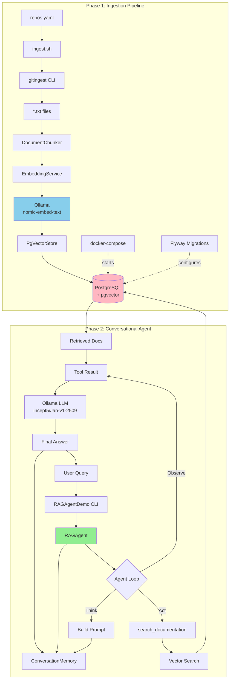

# Stage 3: Agentic RAG - Architecture Documentation

## Overview

**Status**: ❌ TODO  
**Purpose**: Build a production-ready RAG (Retrieval-Augmented Generation) pipeline with conversational memory  
**Workshop Time**: 14:20-14:55 (35 minutes - Agentic RAG & Data Integration)

## Learning Objectives

By the end of this stage, participants will:

1. **Understand RAG fundamentals**: Document ingestion, chunking, embeddings, and vector similarity search
2. **Build production infrastructure**: PostgreSQL with pgvector extension, Flyway migrations
3. **Implement conversational agents**: Multi-turn conversations with memory
4. **Use JSON tool calling**: Native Ollama JSON format (vs XML from Stage 1)
5. **Create end-to-end pipelines**: From code repositories to conversational Q&A

## What Participants Build

### Part 1: Ingestion Pipeline (Shell Script)
- **gitingest integration**: Extract code from Spring AI and Embabel repositories
- **Document processing**: Chunking with overlap for better context
- **Embedding generation**: Use Ollama's `nomic-embed-text` model
- **Vector storage**: PostgreSQL with pgvector extension
- **Idempotent ingestion**: Hash-based change detection, safe re-runs

### Part 2: RAG-Enabled Agent (Java)
- **Conversational agent**: Multi-turn conversations with context retention
- **Vector search tool**: Retrieve relevant documentation on-demand
- **JSON tool calling**: Native Ollama format for cleaner integration
- **Conversation memory**: Maintain dialogue context across turns
- **Production patterns**: Connection pooling, proper error handling

---

## System Architecture



---

## Component Architecture

### Directory Structure

```
stage-3-agentic-rag/
├── pom.xml                              # Maven configuration with new dependencies
├── README.md                            # Stage-specific instructions
├── architecture.md                      # This file
├── run.sh                               # Run conversational agent
├── ingest.sh                            # Ingestion pipeline script
├── repos.yaml                           # Repository configuration
├── docker-compose.yml                   # PostgreSQL + pgvector setup
│
├── db/
│   └── migration/
│       └── V1__Create_documents_table.sql    # Flyway migration
│
├── data/                                # .gitignored
│   └── gitingest-output/
│       ├── spring-ai.txt
│       ├── embabel-agent.txt
│       └── ...
│
└── src/
    ├── main/java/com/incept5/workshop/stage3/
    │   ├── RAGAgent.java                     # Main conversational agent
    │   ├── RAGAgentDemo.java                 # CLI demonstration
    │   │
    │   ├── db/
    │   │   ├── PgVectorStore.java            # Vector store operations
    │   │   ├── Document.java                 # Document record
    │   │   └── DatabaseConfig.java           # HikariCP connection pool
    │   │
    │   ├── ingestion/
    │   │   ├── DocumentChunker.java          # Split documents into chunks
    │   │   ├── EmbeddingService.java         # Generate embeddings via Ollama
    │   │   └── IngestionService.java         # Coordinate ingestion process
    │   │
    │   ├── tool/
    │   │   ├── RAGTool.java                  # Documentation search tool
    │   │   └── ToolRegistry.java             # Tool management
    │   │
    │   └── util/
    │       ├── JsonToolCallParser.java       # Parse JSON tool calls
    │       └── ConversationMemory.java       # Track conversation history
    │
    └── test/java/com/incept5/workshop/stage3/
        ├── README.md                         # Test documentation
        └── RAGAgentIntegrationTest.java      # End-to-end test
```

---

## Core Components

### 1. Ingestion Pipeline (`ingest.sh`)

**Purpose**: One-command setup and data ingestion

**Workflow**:
```bash
#!/bin/bash
# Stage 3: RAG Ingestion Pipeline

set -e  # Exit on error

echo "🚀 Stage 3: RAG Ingestion Pipeline"
echo

# Step 1: Check/Install gitingest
if ! command -v gitingest &> /dev/null; then
    echo "📦 Installing gitingest via pipx..."
    pipx install gitingest
fi

# Step 2: Start PostgreSQL + pgvector
echo "🐘 Starting PostgreSQL with pgvector..."
docker-compose up -d
sleep 5  # Wait for startup

# Step 3: Run Flyway migrations
echo "🔧 Running database migrations..."
docker run --rm \
    --network=host \
    -v "$PWD/db/migration:/flyway/sql" \
    flyway/flyway:11-alpine \
    -url=jdbc:postgresql://localhost:5432/workshop_rag \
    -user=workshop -password=workshop123 \
    migrate

# Step 4: Process each repository from repos.yaml
echo "📚 Ingesting repositories..."
java -cp target/stage-3-agentic-rag.jar \
    com.incept5.workshop.stage3.ingestion.IngestionService \
    repos.yaml

echo
echo "✅ Ingestion complete!"
```

**Features**:
- **Idempotent**: Safe to re-run, only processes new/changed files
- **Hash-based tracking**: SHA-256 checksums detect content changes
- **Progress feedback**: Clear output showing what's being processed
- **Error handling**: Stops on first error with clear messages

### 2. Repository Configuration (`repos.yaml`)

```yaml
repositories:
  - name: spring-ai
    url: https://github.com/spring-projects/spring-ai
    branch: main
    description: "Spring AI framework - core concepts and APIs"
    
  - name: embabel-agent
    url: https://github.com/embabel/embabel-agent
    branch: main
    description: "Embabel agent framework - core library"
    
  - name: embabel-examples
    url: https://github.com/embabel/embabel-agent-examples
    branch: main
    description: "Embabel practical examples and patterns"
    
  - name: embabel-java-template
    url: https://github.com/embabel/java-agent-template
    branch: main
    description: "Embabel Java project template"
    
  - name: embabel-kotlin-template
    url: https://github.com/embabel/kotlin-agent-template
    branch: main
    description: "Embabel Kotlin project template"
    
  - name: tripper
    url: https://github.com/embabel/tripper
    branch: main
    description: "Embabel advanced example - travel planner"

# Ingestion settings
settings:
  chunk_size: 800          # tokens per chunk
  chunk_overlap: 200       # overlap for context
  similarity_threshold: 0.7  # minimum cosine similarity
```

### 3. Database Schema (Flyway Migration)

**File**: `db/migration/V1__Create_documents_table.sql`

```sql
-- Enable pgvector extension
CREATE EXTENSION IF NOT EXISTS vector;

-- Documents table with embeddings
-- Stores chunked documents with their vector embeddings
CREATE TABLE documents (
    id SERIAL PRIMARY KEY,
    content TEXT NOT NULL,                    -- The actual document chunk
    source VARCHAR(255) NOT NULL,             -- e.g., "spring-ai", "embabel-agent"
    file_hash VARCHAR(64) NOT NULL,           -- SHA-256 of original file
    chunk_index INTEGER NOT NULL,             -- Chunk number within file
    metadata JSONB,                           -- Additional metadata (branch, description, etc.)
    embedding vector(1024),                   -- nomic-embed-text produces 1024-dim vectors
    created_at TIMESTAMP DEFAULT CURRENT_TIMESTAMP,
    
    -- Ensure we don't duplicate chunks
    UNIQUE(source, file_hash, chunk_index)
);

-- Index for efficient vector similarity search
-- IVFFlat (Inverted File with Flat compression) is faster than exact search
-- cosine distance is best for normalized embeddings
CREATE INDEX ON documents 
    USING ivfflat (embedding vector_cosine_ops)
    WITH (lists = 100);

-- Indexes for metadata queries
CREATE INDEX idx_documents_source ON documents(source);
CREATE INDEX idx_documents_file_hash ON documents(file_hash);
CREATE INDEX idx_documents_metadata ON documents USING gin(metadata);

-- Function for similarity search (helper for testing)
CREATE OR REPLACE FUNCTION search_documents(
    query_embedding vector(1024),
    match_threshold float,
    match_count int
)
RETURNS TABLE (
    id int,
    content text,
    source varchar(255),
    similarity float
)
LANGUAGE sql
AS $$
    SELECT
        id,
        content,
        source,
        1 - (embedding <=> query_embedding) as similarity
    FROM documents
    WHERE 1 - (embedding <=> query_embedding) > match_threshold
    ORDER BY similarity DESC
    LIMIT match_count;
$$;
```

**Why pgvector?**
- **Production-ready**: Battle-tested, used by major companies
- **ACID transactions**: Data integrity guarantees
- **SQL interface**: Familiar query language
- **Hybrid queries**: Combine vector search with metadata filters
- **Scalable**: Handles millions of vectors efficiently

### 4. Java Components

#### 4.1 RAGAgent.java (~250 lines)

**Purpose**: Main conversational agent with memory

```java
/**
 * RAG-enabled conversational agent.
 * 
 * Features:
 * - Multi-turn conversations with context retention
 * - JSON-format tool calling (Ollama native)
 * - Vector search for relevant documentation
 * - Configurable conversation history length
 * 
 * Example:
 * <pre>
 * RAGAgent agent = RAGAgent.builder()
 *     .backend(backend)
 *     .vectorStore(vectorStore)
 *     .maxConversationHistory(10)
 *     .build();
 * 
 * String response1 = agent.chat("What is Embabel?");
 * String response2 = agent.chat("Show me an example");  // Uses context from first question
 * </pre>
 */
public class RAGAgent {
    private final AIBackend backend;
    private final ToolRegistry toolRegistry;
    private final ConversationMemory memory;
    private final int maxIterations;
    
    // System prompt with JSON tool schema
    private static final String SYSTEM_PROMPT = """
        You are a helpful assistant that answers questions about the Embabel framework and Spring AI.
        
        You have access to the following tool:
        
        {
          "name": "search_documentation",
          "description": "Search Embabel and Spring AI documentation for relevant information",
          "parameters": {
            "type": "object",
            "properties": {
              "query": {
                "type": "string",
                "description": "The search query to find relevant documentation"
              },
              "topK": {
                "type": "integer",
                "description": "Number of results to return (default: 5, max: 10)"
              }
            },
            "required": ["query"]
          }
        }
        
        To use the tool, respond with ONLY a JSON object:
        {
          "tool": "search_documentation",
          "parameters": {
            "query": "your search query",
            "topK": 5
          }
        }
        
        After receiving tool results, provide a natural, helpful answer to the user.
        Do not mention that you used a tool or searched documentation unless specifically asked.
        """;
    
    /**
     * Process a user message and return the agent's response.
     * Maintains conversation context across multiple turns.
     */
    public String chat(String userMessage) {
        // 1. Add user message to conversation memory
        memory.addUserMessage(userMessage);
        
        // 2. Agent loop: think → act → observe
        String finalResponse = null;
        for (int i = 0; i < maxIterations; i++) {
            // Build prompt with conversation history
            String prompt = buildPromptWithHistory();
            
            // Get LLM response
            AIResponse response = backend.generate(prompt, SYSTEM_PROMPT, Map.of());
            String content = response.response().trim();
            
            // Check if response is a tool call (JSON format)
            Optional<ToolCall> toolCall = JsonToolCallParser.parse(content);
            
            if (toolCall.isEmpty()) {
                // Final answer - not a tool call
                finalResponse = content;
                memory.addAssistantMessage(content);
                break;
            }
            
            // Execute tool
            Tool tool = toolRegistry.getTool(toolCall.get().name());
            String toolResult = tool.execute(toolCall.get().parameters());
            
            // Add tool result to memory as system message
            memory.addSystemMessage("Tool result: " + toolResult);
        }
        
        if (finalResponse == null) {
            finalResponse = "I apologize, but I couldn't complete the task within the iteration limit.";
            memory.addAssistantMessage(finalResponse);
        }
        
        return finalResponse;
    }
    
    private String buildPromptWithHistory() {
        StringBuilder prompt = new StringBuilder();
        
        // Include conversation history for context
        for (Message msg : memory.getHistory()) {
            if (msg instanceof UserMessage) {
                prompt.append("User: ").append(msg.content()).append("\n\n");
            } else if (msg instanceof AssistantMessage) {
                prompt.append("Assistant: ").append(msg.content()).append("\n\n");
            } else if (msg instanceof SystemMessage) {
                prompt.append("System: ").append(msg.content()).append("\n\n");
            }
        }
        
        return prompt.toString();
    }
    
    public static Builder builder() {
        return new Builder();
    }
    
    public static class Builder {
        // Builder implementation
    }
}
```

#### 4.2 PgVectorStore.java (~200 lines)

**Purpose**: Vector database operations with pgvector

```java
/**
 * PostgreSQL vector store using pgvector extension.
 * 
 * Provides:
 * - Document storage with embeddings
 * - Similarity search with cosine distance
 * - Metadata filtering
 * - Idempotent ingestion (hash-based deduplication)
 */
public class PgVectorStore {
    private final DataSource dataSource;
    private final EmbeddingService embeddingService;
    
    /**
     * Store a document chunk with its embedding.
     * Uses file hash to avoid duplicate ingestion.
     */
    public void store(String content, String source, String fileHash, 
                     int chunkIndex, Map<String, Object> metadata) {
        // 1. Generate embedding for the content
        float[] embedding = embeddingService.generateEmbedding(content);
        
        // 2. Convert embedding to pgvector format
        String vectorString = Arrays.stream(embedding)
            .mapToObj(String::valueOf)
            .collect(Collectors.joining(",", "[", "]"));
        
        // 3. Store in database (ON CONFLICT DO NOTHING for idempotency)
        String sql = """
            INSERT INTO documents (content, source, file_hash, chunk_index, metadata, embedding)
            VALUES (?, ?, ?, ?, ?::jsonb, ?::vector)
            ON CONFLICT (source, file_hash, chunk_index) DO NOTHING
            """;
        
        try (Connection conn = dataSource.getConnection();
             PreparedStatement stmt = conn.prepareStatement(sql)) {
            stmt.setString(1, content);
            stmt.setString(2, source);
            stmt.setString(3, fileHash);
            stmt.setInt(4, chunkIndex);
            stmt.setString(5, new Gson().toJson(metadata));
            stmt.setString(6, vectorString);
            stmt.executeUpdate();
        }
    }
    
    /**
     * Search for documents similar to the query.
     * 
     * @param query The search query
     * @param topK Number of results to return
     * @param threshold Minimum similarity score (0-1)
     * @return List of matching documents
     */
    public List<Document> search(String query, int topK, double threshold) {
        // 1. Generate query embedding
        float[] queryEmbedding = embeddingService.generateEmbedding(query);
        
        // 2. Convert to pgvector format
        String vectorString = Arrays.stream(queryEmbedding)
            .mapToObj(String::valueOf)
            .collect(Collectors.joining(",", "[", "]"));
        
        // 3. Execute similarity search
        // Uses cosine distance (<=> operator) from pgvector
        String sql = """
            SELECT id, content, source, metadata,
                   1 - (embedding <=> ?::vector) as similarity
            FROM documents
            WHERE 1 - (embedding <=> ?::vector) > ?
            ORDER BY similarity DESC
            LIMIT ?
            """;
        
        List<Document> results = new ArrayList<>();
        
        try (Connection conn = dataSource.getConnection();
             PreparedStatement stmt = conn.prepareStatement(sql)) {
            stmt.setString(1, vectorString);
            stmt.setString(2, vectorString);
            stmt.setDouble(3, threshold);
            stmt.setInt(4, topK);
            
            try (ResultSet rs = stmt.executeQuery()) {
                while (rs.next()) {
                    results.add(new Document(
                        rs.getInt("id"),
                        rs.getString("content"),
                        rs.getString("source"),
                        rs.getString("metadata"),
                        rs.getDouble("similarity")
                    ));
                }
            }
        }
        
        return results;
    }
    
    /**
     * Check if a file has already been ingested.
     */
    public boolean isIngested(String source, String fileHash) {
        String sql = "SELECT EXISTS(SELECT 1 FROM documents WHERE source = ? AND file_hash = ?)";
        
        try (Connection conn = dataSource.getConnection();
             PreparedStatement stmt = conn.prepareStatement(sql)) {
            stmt.setString(1, source);
            stmt.setString(2, fileHash);
            
            try (ResultSet rs = stmt.executeQuery()) {
                return rs.next() && rs.getBoolean(1);
            }
        }
    }
}
```

#### 4.3 RAGTool.java (~100 lines)

**Purpose**: Tool for searching documentation via vector similarity

```java
/**
 * Tool for searching Embabel and Spring AI documentation.
 * 
 * This tool is exposed to the LLM via JSON schema.
 * The agent can call this tool to retrieve relevant documentation
 * before answering user questions.
 */
public class RAGTool implements Tool {
    private final PgVectorStore vectorStore;
    
    @Override
    public String name() {
        return "search_documentation";
    }
    
    @Override
    public String description() {
        return "Search Embabel and Spring AI documentation for relevant information";
    }
    
    /**
     * Execute the tool with given parameters.
     * 
     * Expected parameters:
     * - query (String): The search query
     * - topK (Integer, optional): Number of results (default: 5)
     */
    @Override
    public String execute(Map<String, Object> arguments) {
        // Extract parameters
        String query = (String) arguments.get("query");
        Integer topK = (Integer) arguments.getOrDefault("topK", 5);
        
        // Limit topK to reasonable range
        topK = Math.min(Math.max(topK, 1), 10);
        
        // Search vector store
        List<Document> documents = vectorStore.search(query, topK, 0.7);
        
        if (documents.isEmpty()) {
            return "No relevant documentation found for the query.";
        }
        
        // Format results for LLM consumption
        return formatDocuments(documents);
    }
    
    private String formatDocuments(List<Document> documents) {
        StringBuilder result = new StringBuilder();
        result.append("Found ").append(documents.size()).append(" relevant documents:\n\n");
        
        for (int i = 0; i < documents.size(); i++) {
            Document doc = documents.get(i);
            result.append(String.format("Document %d (similarity: %.2f, source: %s):\n",
                i + 1, doc.similarity(), doc.source()));
            result.append(doc.content());
            result.append("\n\n---\n\n");
        }
        
        return result.toString();
    }
}
```

#### 4.4 JsonToolCallParser.java (~80 lines)

**Purpose**: Parse Ollama's JSON tool call format

```java
/**
 * Parser for JSON-format tool calls.
 * 
 * Ollama natively supports JSON tool calling format:
 * {
 *   "tool": "search_documentation",
 *   "parameters": {
 *     "query": "how to create an agent",
 *     "topK": 3
 *   }
 * }
 * 
 * This is cleaner than XML format used in Stage 1.
 */
public class JsonToolCallParser {
    private static final Gson gson = new Gson();
    
    /**
     * Parse a potential tool call from LLM response.
     * 
     * @return Optional containing ToolCall if valid JSON tool call, empty otherwise
     */
    public static Optional<ToolCall> parse(String response) {
        try {
            // Try to parse as JSON
            JsonObject json = gson.fromJson(response.trim(), JsonObject.class);
            
            // Check for required fields
            if (!json.has("tool") || !json.has("parameters")) {
                return Optional.empty();
            }
            
            String toolName = json.get("tool").getAsString();
            JsonObject params = json.getAsJsonObject("parameters");
            
            // Convert parameters to Map
            Map<String, Object> parameters = new HashMap<>();
            for (Map.Entry<String, JsonElement> entry : params.entrySet()) {
                JsonElement value = entry.getValue();
                if (value.isJsonPrimitive()) {
                    JsonPrimitive primitive = value.getAsJsonPrimitive();
                    if (primitive.isString()) {
                        parameters.put(entry.getKey(), primitive.getAsString());
                    } else if (primitive.isNumber()) {
                        parameters.put(entry.getKey(), primitive.getAsInt());
                    } else if (primitive.isBoolean()) {
                        parameters.put(entry.getKey(), primitive.getAsBoolean());
                    }
                }
            }
            
            return Optional.of(new ToolCall(toolName, parameters));
            
        } catch (JsonSyntaxException e) {
            // Not a valid JSON tool call
            return Optional.empty();
        }
    }
    
    public record ToolCall(String name, Map<String, Object> parameters) {}
}
```

#### 4.5 ConversationMemory.java (~100 lines)

**Purpose**: Track conversation history for context retention

```java
/**
 * In-memory conversation history tracker.
 * 
 * Maintains a sliding window of recent messages to provide context
 * for multi-turn conversations. Automatically trims old messages
 * to stay within token limits.
 */
public class ConversationMemory {
    private final Deque<Message> messages;
    private final int maxMessages;
    
    public ConversationMemory(int maxMessages) {
        this.messages = new ArrayDeque<>();
        this.maxMessages = maxMessages;
    }
    
    /**
     * Add a user message to the conversation.
     */
    public void addUserMessage(String content) {
        messages.add(new UserMessage(content));
        trimIfNeeded();
    }
    
    /**
     * Add an assistant message to the conversation.
     */
    public void addAssistantMessage(String content) {
        messages.add(new AssistantMessage(content));
        trimIfNeeded();
    }
    
    /**
     * Add a system message (e.g., tool results) to the conversation.
     */
    public void addSystemMessage(String content) {
        messages.add(new SystemMessage(content));
        trimIfNeeded();
    }
    
    /**
     * Get the full conversation history.
     */
    public List<Message> getHistory() {
        return new ArrayList<>(messages);
    }
    
    /**
     * Clear all conversation history.
     */
    public void clear() {
        messages.clear();
    }
    
    /**
     * Trim conversation to stay within max message limit.
     * Removes oldest messages first.
     */
    private void trimIfNeeded() {
        while (messages.size() > maxMessages) {
            messages.removeFirst();
        }
    }
    
    // Message types
    public interface Message {
        String content();
    }
    
    public record UserMessage(String content) implements Message {}
    public record AssistantMessage(String content) implements Message {}
    public record SystemMessage(String content) implements Message {}
}
```

#### 4.6 DocumentChunker.java (~120 lines)

**Purpose**: Split documents into overlapping chunks

```java
/**
 * Document chunker with overlap for better context preservation.
 * 
 * Strategy:
 * 1. Split on paragraph boundaries first (double newlines)
 * 2. If paragraph is too large, split further
 * 3. Add overlap between chunks for context continuity
 * 
 * Example:
 * Input: "Para 1...\n\nPara 2...\n\nPara 3..."
 * Output: [
 *   "Para 1...\n\nPara 2...",
 *   "Para 2...\n\nPara 3...",  // Overlap: Para 2
 *   ...
 * ]
 */
public class DocumentChunker {
    private final int chunkSize;      // Target size in tokens
    private final int chunkOverlap;   // Overlap in tokens
    
    public DocumentChunker(int chunkSize, int chunkOverlap) {
        this.chunkSize = chunkSize;
        this.chunkOverlap = chunkOverlap;
    }
    
    /**
     * Chunk a document into overlapping segments.
     */
    public List<String> chunk(String content) {
        // 1. Split into paragraphs
        String[] paragraphs = content.split("\n\n+");
        
        List<String> chunks = new ArrayList<>();
        StringBuilder currentChunk = new StringBuilder();
        int currentTokens = 0;
        
        for (String paragraph : paragraphs) {
            int paragraphTokens = estimateTokens(paragraph);
            
            // If paragraph alone exceeds chunk size, split it
            if (paragraphTokens > chunkSize) {
                // Add current chunk if not empty
                if (currentChunk.length() > 0) {
                    chunks.add(currentChunk.toString().trim());
                    currentChunk = new StringBuilder();
                    currentTokens = 0;
                }
                
                // Split large paragraph by sentences
                chunks.addAll(splitLargeParagraph(paragraph));
                continue;
            }
            
            // Would adding this paragraph exceed chunk size?
            if (currentTokens + paragraphTokens > chunkSize) {
                // Save current chunk
                chunks.add(currentChunk.toString().trim());
                
                // Start new chunk with overlap
                currentChunk = new StringBuilder();
                currentTokens = 0;
                
                // Add overlap from previous chunk
                String overlap = getOverlap(chunks.get(chunks.size() - 1));
                currentChunk.append(overlap).append("\n\n");
                currentTokens = estimateTokens(overlap);
            }
            
            // Add paragraph to current chunk
            currentChunk.append(paragraph).append("\n\n");
            currentTokens += paragraphTokens;
        }
        
        // Add final chunk
        if (currentChunk.length() > 0) {
            chunks.add(currentChunk.toString().trim());
        }
        
        return chunks;
    }
    
    private List<String> splitLargeParagraph(String paragraph) {
        // Split by sentences, then combine until chunk size reached
        // Implementation details...
    }
    
    private String getOverlap(String previousChunk) {
        int targetOverlapChars = chunkOverlap * 4; // Rough estimate: 4 chars per token
        
        if (previousChunk.length() <= targetOverlapChars) {
            return previousChunk;
        }
        
        // Take last N characters, but try to start at word boundary
        return previousChunk.substring(previousChunk.length() - targetOverlapChars);
    }
    
    private int estimateTokens(String text) {
        // Rough estimate: ~4 characters per token
        return text.length() / 4;
    }
}
```

#### 4.7 EmbeddingService.java (~80 lines)

**Purpose**: Generate embeddings using Ollama

```java
/**
 * Embedding generation service using Ollama.
 * 
 * Uses the nomic-embed-text model which produces 1024-dimensional embeddings.
 * These embeddings are optimized for semantic search and clustering.
 */
public class EmbeddingService {
    private final String baseUrl;
    private final String model;
    private final HttpClient httpClient;
    private final Gson gson;
    
    public EmbeddingService(String baseUrl, String model) {
        this.baseUrl = baseUrl;
        this.model = model;
        this.httpClient = HttpClient.newHttpClient();
        this.gson = new Gson();
    }
    
    /**
     * Generate embedding vector for the given text.
     * 
     * @param text The text to embed
     * @return 1024-dimensional embedding vector
     */
    public float[] generateEmbedding(String text) {
        try {
            // Build request
            Map<String, Object> requestBody = Map.of(
                "model", model,
                "prompt", text
            );
            
            HttpRequest request = HttpRequest.newBuilder()
                .uri(URI.create(baseUrl + "/api/embeddings"))
                .header("Content-Type", "application/json")
                .POST(HttpRequest.BodyPublishers.ofString(gson.toJson(requestBody)))
                .build();
            
            // Send request
            HttpResponse<String> response = httpClient.send(request, 
                HttpResponse.BodyHandlers.ofString());
            
            if (response.statusCode() != 200) {
                throw new RuntimeException("Embedding generation failed: " + 
                    response.statusCode());
            }
            
            // Parse response
            JsonObject json = gson.fromJson(response.body(), JsonObject.class);
            JsonArray embeddingArray = json.getAsJsonArray("embedding");
            
            float[] embedding = new float[embeddingArray.size()];
            for (int i = 0; i < embeddingArray.size(); i++) {
                embedding[i] = embeddingArray.get(i).getAsFloat();
            }
            
            return embedding;
            
        } catch (Exception e) {
            throw new RuntimeException("Failed to generate embedding", e);
        }
    }
}
```

---

## Technologies & Dependencies

### Core Technologies

- **PostgreSQL 17**: Relational database with ACID guarantees
- **pgvector**: Vector similarity search extension
- **Ollama**: Local LLM inference and embeddings
- **nomic-embed-text**: 1024-dimensional embedding model
- **Flyway**: Database migration and versioning
- **HikariCP**: High-performance JDBC connection pooling
- **gitingest**: Repository-to-text extraction tool

### Maven Dependencies

```xml
<!-- PostgreSQL Driver -->
<dependency>
    <groupId>org.postgresql</groupId>
    <artifactId>postgresql</artifactId>
    <version>42.7.4</version>
</dependency>

<!-- pgvector Java Client -->
<dependency>
    <groupId>com.pgvector</groupId>
    <artifactId>pgvector</artifactId>
    <version>0.1.6</version>
</dependency>

<!-- HikariCP Connection Pooling -->
<dependency>
    <groupId>com.zaxxer</groupId>
    <artifactId>HikariCP</artifactId>
    <version>6.2.1</version>
</dependency>

<!-- Flyway Database Migrations -->
<dependency>
    <groupId>org.flywaydb</groupId>
    <artifactId>flyway-core</artifactId>
    <version>11.1.0</version>
</dependency>
<dependency>
    <groupId>org.flywaydb</groupId>
    <artifactId>flyway-database-postgresql</artifactId>
    <version>11.1.0</version>
    <scope>runtime</scope>
</dependency>

<!-- YAML Configuration -->
<dependency>
    <groupId>org.yaml</groupId>
    <artifactId>snakeyaml</artifactId>
    <version>2.3</version>
</dependency>

<!-- Gson for JSON Processing -->
<dependency>
    <groupId>com.google.code.gson</groupId>
    <artifactId>gson</artifactId>
    <version>2.11.0</version>
</dependency>
```

---

## Usage Examples

### 1. Initial Setup & Ingestion

```bash
cd stage-3-agentic-rag

# One command to setup everything
./ingest.sh

# Output:
# 🚀 Stage 3: RAG Ingestion Pipeline
# 
# ✓ gitingest already installed
# 🐘 Starting PostgreSQL with pgvector...
# ✓ PostgreSQL ready
# 🔧 Running database migrations...
# ✓ Migrations complete
# 📚 Ingesting repositories...
# 
# Processing spring-ai...
#   → Downloaded: 1.2MB
#   → Chunks created: 142
#   → Embeddings generated: 142/142
#   → Stored: 142 documents
# 
# Processing embabel-agent...
#   → Downloaded: 856KB
#   → Chunks created: 98
#   → Embeddings generated: 98/98
#   → Stored: 98 documents
# 
# ...
# 
# ✅ Ingestion complete!
# Total documents: 487
# Total repositories: 6
```

### 2. Running the Conversational Agent

```bash
./run.sh

# Interactive CLI:
# ╔════════════════════════════════════════════════════╗
# ║  RAG Agent - Embabel & Spring AI Assistant        ║
# ║  Type 'exit' or 'quit' to end the conversation   ║
# ╚════════════════════════════════════════════════════╝
# 
# You: What is Embabel and how does it work?
# 
# [Agent thinking...]
# [Searching documentation...]
# 
# Agent: Embabel is an agent framework for the JVM that uses 
# Goal-Oriented Action Planning (GOAP) to build intelligent 
# applications. It's designed by Rod Johnson, creator of Spring 
# Framework.
# 
# Key concepts:
# - @Agent annotation to define agent behavior
# - Actions: Steps an agent can take
# - Goals: What the agent tries to achieve
# - Conditions: Evaluated during planning
# 
# It builds on Spring AI and provides higher-level abstractions
# for complex agent workflows...
# 
# You: Can you show me a simple example?
# 
# [Using conversation context...]
# [Searching documentation...]
# 
# Agent: Here's a basic Embabel agent example:
# 
# @Agent(description = "Quiz generator agent")
# public class QuizAgent {
#     
#     @Action(description = "Fetch web content")
#     public WebContent fetchContent(String url) {
#         // Implementation
#     }
#     
#     @Action(description = "Generate quiz from content")
#     public Quiz generateQuiz(WebContent content) {
#         // Implementation
#     }
#     
#     @Goal
#     public Quiz createQuizFromUrl(String url) {
#         // Embabel will plan the sequence of actions
#         return null;  // Placeholder
#     }
# }
# 
# The framework automatically determines the action sequence
# needed to achieve the goal...
# 
# You: exit
# 
# Goodbye!
```

### 3. Programmatic Usage

```java
// Build the agent
PgVectorStore vectorStore = new PgVectorStore(dataSource, embeddingService);
ToolRegistry toolRegistry = new ToolRegistry();
toolRegistry.register(new RAGTool(vectorStore));

RAGAgent agent = RAGAgent.builder()
    .backend(ollamaBackend)
    .toolRegistry(toolRegistry)
    .maxConversationHistory(10)
    .maxIterations(10)
    .build();

// Single question
String response1 = agent.chat("What is Embabel?");
System.out.println(response1);

// Follow-up question (uses context)
String response2 = agent.chat("How does it integrate with Spring AI?");
System.out.println(response2);

// Ask for code example
String response3 = agent.chat("Show me a code example");
System.out.println(response3);
```

### 4. Direct Vector Search (Testing)

```java
// Direct search without agent
List<Document> results = vectorStore.search(
    "How to create an agent with Embabel?",
    5,      // top 5 results
    0.7     // similarity threshold
);

for (Document doc : results) {
    System.out.printf("Similarity: %.2f | Source: %s%n", 
        doc.similarity(), doc.source());
    System.out.println(doc.content());
    System.out.println("---");
}
```

### 5. SQL-Based Vector Search

```sql
-- Direct SQL query for testing
SELECT 
    content,
    source,
    1 - (embedding <=> (
        SELECT embedding 
        FROM documents 
        WHERE id = 1  -- Use an example embedding
    )) as similarity
FROM documents
WHERE 1 - (embedding <=> (SELECT embedding FROM documents WHERE id = 1)) > 0.7
ORDER BY similarity DESC
LIMIT 5;
```

---

## Testing Strategy

### Integration Test Coverage

**File**: `RAGAgentIntegrationTest.java`

**Test Scenarios**:

1. **Database Setup**: Verify PostgreSQL + pgvector are running
2. **Document Ingestion**: Store and retrieve test documents
3. **Vector Search**: Test similarity search with known queries
4. **Single-Turn Conversation**: Ask one question, verify answer quality
5. **Multi-Turn Conversation**: Follow-up questions using context
6. **Tool Invocation**: Verify agent correctly uses RAG tool
7. **Memory Management**: Verify conversation history is maintained

```java
@Test
void testCompleteRAGFlow() {
    // 1. Setup: Ingest test documents
    String embabelDoc = """
        Embabel is an agent framework for the JVM created by Rod Johnson.
        It uses @Agent annotation to define agent behavior.
        Actions represent steps an agent can take.
        Goals define what the agent tries to achieve.
        """;
    
    String springAIDoc = """
        Spring AI provides ChatClient for interacting with LLMs.
        It supports multiple AI model providers including OpenAI and Ollama.
        The Advisor API enables RAG implementations.
        """;
    
    vectorStore.store(embabelDoc, "embabel-test", "hash1", 0, Map.of());
    vectorStore.store(springAIDoc, "spring-ai-test", "hash2", 0, Map.of());
    
    // 2. Test: Vector search
    List<Document> results = vectorStore.search("What is Embabel?", 2, 0.7);
    assertThat(results).hasSize(1);
    assertThat(results.get(0).content()).contains("Embabel");
    
    // 3. Test: Single-turn conversation
    String response1 = agent.chat("What is Embabel?");
    assertThat(response1).containsAnyOf("Embabel", "agent", "framework", "Rod Johnson");
    
    // 4. Test: Multi-turn conversation with context
    String response2 = agent.chat("Who created it?");
    assertThat(response2).contains("Rod Johnson");
    
    // 5. Test: Follow-up requiring previous context
    String response3 = agent.chat("How does it work with Spring AI?");
    assertThat(response3).containsAnyOf("ChatClient", "integrate", "Spring AI");
    
    // 6. Verify conversation memory
    List<Message> history = agent.getConversationHistory();
    assertThat(history).hasSizeGreaterThanOrEqualTo(6); // 3 questions + 3 answers
}
```

---

## Key Design Decisions

### 1. JSON Tool Calling vs XML (Stage 1)

**Why JSON?**
- Native Ollama support (no custom parsing needed)
- More familiar format for most developers
- Better IDE support and syntax highlighting
- Easier to validate with JSON schemas
- Standard format across multiple LLM providers

**Comparison**:
```
XML (Stage 1):
<tool_name>search_documentation</tool_name>
<parameters>
<query>how to create agent</query>
<topK>5</topK>
</parameters>

JSON (Stage 3):
{
  "tool": "search_documentation",
  "parameters": {
    "query": "how to create agent",
    "topK": 5
  }
}
```

### 2. PostgreSQL + pgvector vs Pure Vector DBs

**Why PostgreSQL?**
- **ACID transactions**: Data integrity guarantees
- **Hybrid queries**: Combine vector search with SQL filters
- **Mature tooling**: Backup, monitoring, scaling well-understood
- **Single database**: No need for separate vector and relational stores
- **Cost-effective**: Open-source, runs anywhere
- **Familiar**: Most Java developers know PostgreSQL

**Trade-offs**:
- Slightly slower than specialized vector DBs (acceptable for workshop)
- Requires pgvector extension installation
- Not as feature-rich as Pinecone/Weaviate for pure vector workloads

### 3. Document Chunking Strategy

**Fixed-size with overlap** was chosen for:
- **Simplicity**: Easy to understand and implement
- **Effectiveness**: Works well for code documentation
- **Predictability**: Consistent chunk sizes
- **Context preservation**: Overlap maintains continuity

**Alternative strategies** (for future exploration):
- Semantic chunking (split on topic boundaries)
- Recursive character text splitting
- Document structure-aware splitting (respect markdown headers, code blocks)

### 4. Conversation Memory: In-Memory vs Persistent

**In-memory chosen for workshop**:
- Simpler implementation
- No additional database schema needed
- Sufficient for single-session conversations
- Easy to understand and debug

**Production enhancement** (Stage 5):
- Persistent storage in PostgreSQL
- Session management with UUIDs
- Support for multiple concurrent users
- Conversation history export/import

### 5. Embedding Model: nomic-embed-text

**Why nomic-embed-text?**
- **Open-source**: Free to use, no API keys
- **Runs locally**: Privacy-preserving
- **Optimized**: Good quality/speed trade-off
- **Ollama support**: Easy integration
- **1024 dimensions**: Good balance of quality and storage

**Alternatives**:
- `all-minilm-l6-v2`: Faster, but lower quality (384 dims)
- OpenAI `text-embedding-ada-002`: Higher quality, requires API key
- Custom fine-tuned models: Best for domain-specific tasks

---

## Performance Considerations

### Vector Search Optimization

**IVFFlat Index**:
```sql
CREATE INDEX ON documents 
    USING ivfflat (embedding vector_cosine_ops)
    WITH (lists = 100);
```

- **lists = 100**: Good starting point for 10K-1M vectors
- **Trade-off**: 10-20% recall loss for 10-20x speed gain
- **Tune**: Increase lists for better recall, decrease for faster search

### Connection Pooling

**HikariCP Configuration**:
```java
HikariConfig config = new HikariConfig();
config.setJdbcUrl("jdbc:postgresql://localhost:5432/workshop_rag");
config.setUsername("workshop");
config.setPassword("workshop123");
config.setMaximumPoolSize(10);        // Max connections
config.setMinimumIdle(2);             // Min idle connections
config.setConnectionTimeout(30000);   // 30 seconds
config.setIdleTimeout(600000);        // 10 minutes
config.setMaxLifetime(1800000);       // 30 minutes
```

### Embedding Generation

**Batch Processing**:
```java
// Process embeddings in batches to avoid overwhelming Ollama
List<String> chunks = ... // 100 chunks
int batchSize = 10;

for (int i = 0; i < chunks.size(); i += batchSize) {
    List<String> batch = chunks.subList(i, 
        Math.min(i + batchSize, chunks.size()));
    
    // Generate embeddings for batch
    for (String chunk : batch) {
        float[] embedding = embeddingService.generateEmbedding(chunk);
        // Store immediately
        vectorStore.store(chunk, ...);
    }
    
    // Progress feedback
    System.out.printf("Progress: %d/%d chunks%n", i + batchSize, chunks.size());
}
```

---

## Workshop Learning Path

### Phase 1: Understanding (5 minutes)

**Instructor demonstrates**:
1. Run completed agent: `./run.sh`
2. Ask: "What is Embabel?"
3. Follow-up: "Show me an example"
4. Explain: Vector search happened behind the scenes

**Key concepts covered**:
- RAG overview (retrieval → augmentation → generation)
- Why vector search beats keyword search
- Importance of conversation memory
- JSON tool calling

### Phase 2: Hands-On Setup (10 minutes)

**Participants execute**:
```bash
cd stage-3-agentic-rag
./ingest.sh
```

**While ingestion runs, explore**:
```bash
# Connect to PostgreSQL
docker exec -it stage3-pgvector psql -U workshop -d workshop_rag

# Check documents table
\d documents

# Count total documents
SELECT COUNT(*), source FROM documents GROUP BY source;

# View a sample document
SELECT content, source FROM documents LIMIT 1;

# Test vector search (manually)
SELECT content, source, 
       1 - (embedding <=> (SELECT embedding FROM documents LIMIT 1)) as similarity
FROM documents
WHERE 1 - (embedding <=> (SELECT embedding FROM documents LIMIT 1)) > 0.7
ORDER BY similarity DESC
LIMIT 3;
```

### Phase 3: Code Walkthrough (10 minutes)

**Follow the flow**:
1. **User query** → `RAGAgent.chat()`
2. **Agent loop** → Think (LLM) → Act (tool) → Observe (result)
3. **Tool invocation** → `RAGTool.execute()`
4. **Vector search** → `PgVectorStore.search()`
5. **Context building** → Format retrieved documents
6. **Final answer** → LLM generates response
7. **Memory** → Store in `ConversationMemory`

**Key code to examine**:
- `RAGAgent.java`: Agent loop with JSON parsing
- `PgVectorStore.java`: Similarity search query
- `JsonToolCallParser.java`: Parse tool calls
- `ConversationMemory.java`: Context management

### Phase 4: Experimentation (10 minutes)

**Try different queries**:
```
"What is GOAP?"
"How do I use Spring AI?"
"Compare Embabel and LangChain"
"Show me a complex agent example"
```

**Modify and test**:
1. Adjust similarity threshold in `RAGTool.java`
2. Change chunk size in `repos.yaml`
3. Modify conversation history length
4. Add metadata filters to vector search

**Challenges**:
- Make the agent answer: "What are the key differences between Spring AI and LangChain?"
- Get the agent to provide a code example without explicitly asking
- Test conversation memory by asking follow-up questions

---

## Extension Opportunities

After completing Stage 3, participants can explore:

### 1. Advanced Chunking Strategies

**Semantic Chunking**:
```java
public class SemanticChunker {
    // Split based on topic changes using embeddings
    // - Generate embeddings for sentences
    // - Detect topic shifts using cosine similarity
    // - Create chunks at topic boundaries
}
```

### 2. Hybrid Search (Vector + Keyword)

```java
public List<Document> hybridSearch(String query, int topK) {
    // 1. Vector search (semantic)
    List<Document> vectorResults = vectorStore.search(query, topK * 2, 0.7);
    
    // 2. Full-text search (keyword)
    List<Document> keywordResults = fullTextSearch(query, topK * 2);
    
    // 3. Combine with reciprocal rank fusion
    return combineResults(vectorResults, keywordResults, topK);
}
```

### 3. Document Re-ranking

```java
public List<Document> rerank(List<Document> documents, String query) {
    // Use a smaller, faster model to re-rank retrieved documents
    // - Compute relevance scores
    // - Sort by relevance
    // - Return top K
}
```

### 4. Multi-Query Expansion

```java
public class MultiQueryExpander {
    // Expand user query into multiple diverse queries
    // - "What is Embabel?" →
    //   - "Embabel framework overview"
    //   - "How does Embabel work"
    //   - "Embabel architecture"
}
```

### 5. Metadata Filtering

```java
// Filter by repository, date range, file type
List<Document> results = vectorStore.search(
    "agent examples",
    10,
    0.7,
    Map.of(
        "source", "embabel-examples",
        "file_type", "java",
        "created_after", "2024-01-01"
    )
);
```

### 6. Persistent Conversation Storage

```sql
CREATE TABLE conversations (
    id UUID PRIMARY KEY,
    user_id VARCHAR(255),
    created_at TIMESTAMP DEFAULT CURRENT_TIMESTAMP
);

CREATE TABLE messages (
    id SERIAL PRIMARY KEY,
    conversation_id UUID REFERENCES conversations(id),
    role VARCHAR(50),  -- 'user', 'assistant', 'system'
    content TEXT,
    created_at TIMESTAMP DEFAULT CURRENT_TIMESTAMP
);
```

### 7. Web UI

- Simple HTML/JavaScript frontend
- WebSocket for streaming responses
- Conversation history view
- Document source attribution

---

## Troubleshooting

### Common Issues

**1. PostgreSQL Connection Refused**
```bash
# Check if container is running
docker ps

# Check logs
docker logs stage3-pgvector

# Restart
docker-compose restart
```

**2. Ollama Embedding Generation Fails**
```bash
# Verify Ollama is running
curl http://localhost:11434/api/tags

# Pull embedding model if missing
ollama pull nomic-embed-text

# Test embedding generation
curl http://localhost:11434/api/embeddings -d '{
  "model": "nomic-embed-text",
  "prompt": "test"
}'
```

**3. gitingest Command Not Found**
```bash
# Install with pipx
pipx install gitingest

# Verify installation
gitingest --help

# If pipx not installed
brew install pipx  # macOS
apt install pipx   # Debian/Ubuntu
```

**4. Vector Search Returns No Results**
```sql
-- Check if documents exist
SELECT COUNT(*) FROM documents;

-- Check if embeddings are populated
SELECT COUNT(*) FROM documents WHERE embedding IS NOT NULL;

-- Test with lower threshold
SELECT COUNT(*) FROM documents 
WHERE 1 - (embedding <=> (SELECT embedding FROM documents LIMIT 1)) > 0.5;
```

**5. Agent Stuck in Loop**
- Check `maxIterations` setting
- Verify tool is returning results
- Enable verbose logging:
  ```java
  agent.setVerbose(true);
  ```

---

## Related Documentation

- **Root Architecture**: [/architecture.md](../architecture.md)
- **Stage 1 (Simple Agent)**: [/stage-1-simple-agent/README.md](../stage-1-simple-agent/README.md)
- **Stage 2 (MCP Server)**: [/stage-2-mcp-server/architecture.md](../stage-2-mcp-server/architecture.md) (TODO)
- **Stage 4 (Multi-Agent)**: [/stage-4-multi-agent/architecture.md](../stage-4-multi-agent/architecture.md) (TODO)

### External Resources

- **Spring AI RAG**: https://docs.spring.io/spring-ai/reference/api/retrieval-augmented-generation.html
- **pgvector**: https://github.com/pgvector/pgvector
- **gitingest**: https://github.com/cyclotruc/gitingest
- **Ollama Embeddings**: https://github.com/ollama/ollama/blob/main/docs/api.md#generate-embeddings
- **nomic-embed-text**: https://ollama.com/library/nomic-embed-text

---

*Last updated: 2025-01-06*  
*Stage Status: TODO (Not yet implemented)*  
*Dependencies: stage-0-demo (backend), stage-1-simple-agent (tool patterns)*
