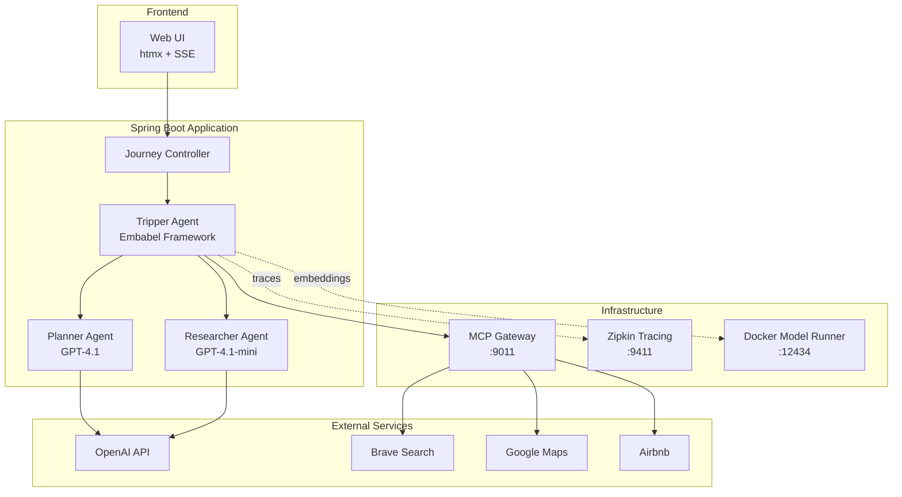

# Stage 4 - Enterprise Multi-Agent System (Embabel Tripper)

**Status**: Reference Implementation (External Repository)  
**Repository**: https://github.com/Incept5/tripper  
**Workshop Time**: 15:15-16:20 (65 minutes)  
**Focus**: Exploration and discussion of production patterns

## Overview

This stage explores **Tripper**, a production-ready travel planning agent built with the Embabel framework, Spring Boot, and Kotlin. Unlike the previous stages where you built code from scratch, this stage focuses on understanding how enterprise patterns come together in a real-world application.

**Why Tripper?**
- Real production code (not a simplified example)
- Demonstrates enterprise patterns in practice
- Shows how multiple LLMs work together
- Illustrates MCP at scale
- Modern Spring Boot + Kotlin architecture

## What You'll Learn

### 1. Multi-Agent Architecture
- **Planner Agent** (GPT-4.1) - High-quality travel planning
- **Researcher Agent** (GPT-4.1-mini) - Cost-effective research
- Role-based personas with goals and backstories
- Deterministic planning with action-based design

### 2. Production Framework (Embabel)
- Action-based agent design (vs. loop-based from Stage 1)
- Type-safe domain models
- Operation context for state management
- Tool call control and response formats

### 3. Spring Boot Integration
- Dependency injection for agent components
- Configuration management (application.yml)
- Spring Security with OAuth2
- Actuator endpoints for monitoring

### 4. Enterprise Patterns
- Multiple LLMs in one application
- Environment-based configuration
- Docker Compose infrastructure
- Distributed tracing with Zipkin
- MCP Gateway for tool management

### 5. MCP at Scale
- 6+ MCP servers (Brave, Wikipedia, Google Maps, Airbnb, Puppeteer, GitHub)
- Gateway pattern for centralized management
- Tool filtering for security
- Docker-based tool isolation

## Prerequisites

### Required Software
1. **Java 21+** - Runtime for Spring Boot
2. **Docker Desktop** - With Model Runner enabled
3. **Maven 3.6+** - Build tool
4. **Git** - To clone the repository

### Required API Keys
See [API_KEYS.md](./API_KEYS.md) for detailed setup instructions:
- **OpenAI API Key** (required) - For GPT-4.1 models
- **Brave Search API Key** (required) - For web search
- **Google Maps API Key** (required) - For mapping services

**Cost Estimate**: ~$0.10 per travel plan

## Setup Instructions

### Step 1: Clone the Repository

```bash
# Clone Tripper from GitHub
cd ~/projects  # or your preferred location
git clone https://github.com/Incept5/tripper.git
cd tripper
```

### Step 2: Configure Environment

```bash
# Copy the example environment file
cp .env.example .env

# Edit .env with your API keys
nano .env  # or use your preferred editor
```

Add your API keys to `.env`:
```bash
# Required API Keys
OPENAI_API_KEY=sk-...
BRAVE_API_KEY=BSA...
GOOGLE_MAPS_API_KEY=AIza...

# Optional (for alternative models)
ANTHROPIC_API_KEY=sk-ant-...
GITHUB_PERSONAL_ACCESS_TOKEN=ghp_...
```

### Step 3: Enable Docker Model Runner

```bash
# Enable Docker Model Runner on port 12434
docker desktop enable model-runner --tcp=12434

# Verify it's running
curl http://localhost:12434/api/tags
```

### Step 4: Start Infrastructure

```bash
# Start MCP Gateway and Zipkin
docker compose --file compose.yaml --file compose.dmr.yaml up -d

# Verify services are running
docker ps
# Should show: mcp-gateway, zipkin
```

### Step 5: Run the Application

**Option A: Using the Run Script**
```bash
./run.sh
```

**Option B: Using Maven**
```bash
mvn spring-boot:run
```

**Option C: Using IDE**
- Import as Maven project
- Run `TripperApplication.kt` main method

### Step 6: Access the Application

Open your browser:
- **Travel Planner**: http://localhost:8747/
- **Platform Info**: http://localhost:8747/platform
- **Actuator**: http://localhost:8747/actuator
- **Zipkin**: http://localhost:9411/

## Application Architecture



## Key Components to Explore

### 1. TripperAgent.kt
**Location**: `src/main/kotlin/com/embabel/tripper/agent/TripperAgent.kt`

The main agent logic demonstrating:
- **Action-based design** - Each step is a defined action
- **Blackboard pattern** - Shared state between actions
- **Tool orchestration** - Coordinating multiple MCP tools
- **Multi-agent workflow** - Planner and researcher collaboration

**Key Methods**:
```kotlin
@Action
fun findPointsOfInterest(
    travelBrief: JourneyTravelBrief,
    travelers: Travelers,
    context: OperationContext
): ItineraryIdeas

@Action
fun researchPointsOfInterest(
    ideas: ItineraryIdeas,
    context: OperationContext
): ResearchedItinerary
```

### 2. application.yml
**Location**: `src/main/resources/application.yml`

Configuration showing:
- **Multiple LLM setup** - Different models for different agents
- **Persona definitions** - Role, goal, backstory for each agent
- **Tool configuration** - MCP server settings
- **Security toggles** - Easy enable/disable

**Key Configuration**:
```yaml
embabel:
  tripper:
    thinker-llm:
      model: gpt-4.1
    
    planner:
      persona:
        name: Hermes
        persona: You are an expert travel planner
      llm:
        model: gpt-4.1
    
    researcher:
      persona:
        role: Researcher
        goal: Research points of interest
      llm:
        model: gpt-4.1-mini
```

### 3. SecurityConfig.kt
**Location**: `src/main/kotlin/com/embabel/agent/web/security/SecurityConfig.kt`

OAuth2 setup demonstrating:
- **Google OAuth2** integration
- **Toggleable security** - Easy dev/prod switch
- **Custom user service** - Extended user information
- **Spring Security 6** patterns

### 4. compose.yaml
**Location**: `compose.yaml`

Infrastructure as code:
- **MCP Gateway** - Centralized tool management
- **Zipkin** - Distributed tracing
- **Environment variables** - Secure secret management
- **Service orchestration** - Multi-container setup

### 5. TripperApplication.kt
**Location**: `src/main/kotlin/com/embabel/tripper/TripperApplication.kt`

Spring Boot entry point:
- **Embabel auto-configuration** - Framework integration
- **Component scanning** - Agent registration
- **Property sources** - Configuration loading

## Comparing to Workshop Stages

### Stage 1: Simple Agent → Tripper's Action-Based Design

**Stage 1 (Loop-Based)**:
```java
while (!completed && iterations < maxIterations) {
    String response = backend.generate(prompt);
    if (hasToolCall(response)) {
        String result = executeTool(toolCall);
        prompt += "\nTool result: " + result;
    } else {
        completed = true;
    }
}
```

**Tripper (Action-Based)**:
```kotlin
@Action
fun findPointsOfInterest(...): ItineraryIdeas {
    return context.ai()
        .withLlm(config.thinkerLlm)
        .withPromptElements(config.planner, travelers)
        .generate(ItineraryIdeas::class)
}
```

**Benefits**:
- More deterministic (explicit workflow)
- Type-safe (domain models)
- Easier to test (isolated actions)
- Better observability (named steps)

### Stage 2: MCP Server → Tripper's MCP Gateway

**Stage 2**: Single MCP server with 2 tools
**Tripper**: MCP Gateway managing 6+ servers with dozens of tools

**Gateway Pattern Benefits**:
- Centralized tool management
- Tool filtering for security
- Service isolation (Docker containers)
- Dynamic tool discovery

### Stage 3: RAG → Tripper's Potential

**Stage 3**: PostgreSQL + pgvector for document retrieval
**Tripper**: Could add RAG for travel knowledge base

**Integration Points**:
- Add vector store for destination knowledge
- Research agent could query RAG before web search
- Store successful itineraries for future reference

## Hands-On Exploration

### Activity 1: Create a Travel Plan (15 min)

1. **Start the application** (if not already running)
2. **Open** http://localhost:8747/
3. **Create a plan**:
   - Destination: "Tokyo, Japan"
   - Duration: "5 days"
   - Interests: "Technology, traditional culture, food"
4. **Watch the process**:
   - Observe SSE events streaming
   - Check Zipkin for distributed traces
   - Review actuator metrics

**Discussion Questions**:
- How does the planner agent use GPT-4.1?
- What tools does the researcher agent call?
- How are the results structured?

### Activity 2: Trace Through Code (20 min)

**Follow the workflow**:

1. **Request Handler**: `JourneyHtmxController.kt`
   - How does Spring handle the request?
   - What triggers the agent?

2. **Agent Logic**: `TripperAgent.kt`
   - Find `findPointsOfInterest` action
   - How does it use the planner persona?
   - What domain model does it return?

3. **Tool Calling**: Through MCP Gateway
   - Which tools are called?
   - How are results aggregated?

4. **Response**: Domain model to UI
   - How is `ResearchedItinerary` structured?
   - How does htmx render it?

### Activity 3: Examine Enterprise Patterns (15 min)

**Explore these files**:

1. **Configuration** (`application.yml`):
   - How are models configured?
   - How are personas defined?
   - What's the security setup?

2. **Security** (`SecurityConfig.kt`):
   - How is OAuth2 configured?
   - How is security toggled?
   - What's the user service doing?

3. **Infrastructure** (`compose.yaml`):
   - What services are defined?
   - How are secrets managed?
   - What's the MCP Gateway doing?

4. **Monitoring** (Actuator + Zipkin):
   - Check http://localhost:8747/actuator/health
   - View traces at http://localhost:9411/
   - What metrics are available?

### Activity 4: Discussion (15 min)

**Key Topics**:

1. **Architecture Decisions**:
   - Why use two different LLMs?
   - Why action-based vs. loop-based?
   - Why MCP Gateway pattern?

2. **Production Considerations**:
   - How would you deploy this?
   - What about cost management?
   - How to monitor in production?

3. **Extensions**:
   - How would you add RAG?
   - How to add more agents?
   - How to customize personas?

## Key Takeaways

### 1. Production Framework Benefits
- **Embabel** provides structure and patterns
- Action-based design is more maintainable
- Type-safe domain models prevent errors
- Built-in observability

### 2. Multi-LLM Strategy
- Use **expensive models** (GPT-4.1) for critical tasks (planning)
- Use **cheaper models** (GPT-4.1-mini) for routine tasks (research)
- Optimize cost without sacrificing quality where it matters

### 3. MCP at Scale
- **Gateway pattern** simplifies management
- Tool filtering adds security
- Docker isolation improves reliability
- Dynamic discovery enables extensibility

### 4. Spring Boot Value
- Mature ecosystem for production
- Easy configuration management
- Built-in security patterns
- Extensive monitoring options

### 5. Real-World Complexity
- Environment management matters
- Multiple services need coordination
- Security from day one
- Monitoring is essential

## Troubleshooting

### Application Won't Start

**Problem**: Port 8747 already in use
```bash
# Solution: Kill existing process
lsof -ti:8747 | xargs kill -9
```

**Problem**: Missing API keys
```bash
# Solution: Check .env file
cat .env | grep API_KEY
```

### Docker Issues

**Problem**: Model Runner not enabled
```bash
# Solution: Enable it
docker desktop enable model-runner --tcp=12434
```

**Problem**: MCP Gateway not starting
```bash
# Solution: Check logs
docker logs mcp-gateway
```

### API Issues

**Problem**: OpenAI rate limit
```bash
# Solution: Wait or upgrade plan
# Check https://platform.openai.com/account/limits
```

**Problem**: Brave Search quota exceeded
```bash
# Solution: Wait for reset or upgrade
# Free tier: 2000 queries/month
```

## Next Steps

After exploring Tripper, consider:

1. **Add RAG Capabilities**
   - Integrate Stage 3's pgvector approach
   - Store travel knowledge base
   - Query before web search

2. **Customize Personas**
   - Modify planner/researcher roles
   - Add new agent types
   - Experiment with different LLMs

3. **Add More Tools**
   - Integrate new MCP servers
   - Create custom tools
   - Extend functionality

4. **Deploy to Production**
   - Containerize the application
   - Set up Kubernetes
   - Configure monitoring
   - Implement cost tracking

5. **Build Your Own Domain**
   - Apply patterns to your use case
   - Design domain models
   - Create specialized agents
   - Integrate with your systems

## Resources

### Tripper
- [GitHub Repository](https://github.com/Incept5/tripper)
- [Setup Guide](./API_KEYS.md)
- [Exploration Guide](./EXPLORATION.md)

### Embabel Framework
- [Embabel Agent](https://github.com/embabel/embabel-agent)
- [Documentation](https://embabel.com)
- [Examples](https://github.com/embabel/embabel-examples)

### Spring Boot
- [Spring Boot Docs](https://spring.io/projects/spring-boot)
- [Spring Security](https://spring.io/projects/spring-security)
- [Spring Actuator](https://docs.spring.io/spring-boot/docs/current/reference/html/actuator.html)

### MCP
- [Model Context Protocol](https://modelcontextprotocol.io/)
- [MCP Specification](https://spec.modelcontextprotocol.io/)
- [MCP Servers](https://github.com/modelcontextprotocol/servers)

## Workshop Wrap-Up

**Congratulations!** You've completed the W-JAX Munich 2025 AI Agents workshop:

✅ **Stage 0**: Backend abstraction and multi-modal support  
✅ **Stage 1**: Simple agent with tool calling  
✅ **Stage 2**: MCP server and client integration  
✅ **Stage 3**: RAG with PostgreSQL + pgvector  
✅ **Stage 4**: Enterprise multi-agent exploration (Tripper)

You now have:
- Deep understanding of agent architectures
- Hands-on experience building agents
- Knowledge of production patterns
- Reference implementations to study
- Foundation for building your own systems

**Keep Building!** 🚀

---

**Workshop Time**: 15:15-16:20 (65 min)  
**Difficulty**: Advanced  
**Key Concepts**: Production architecture, multi-agent, enterprise patterns
